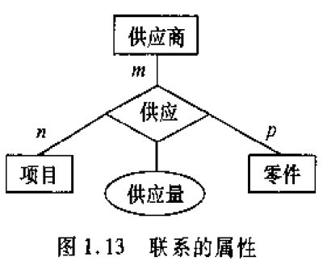
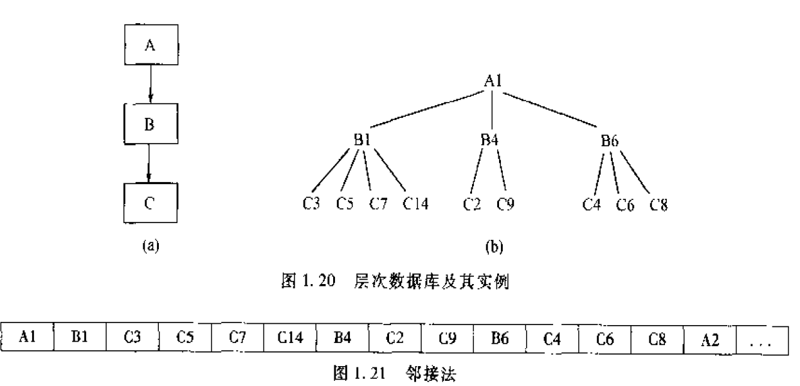
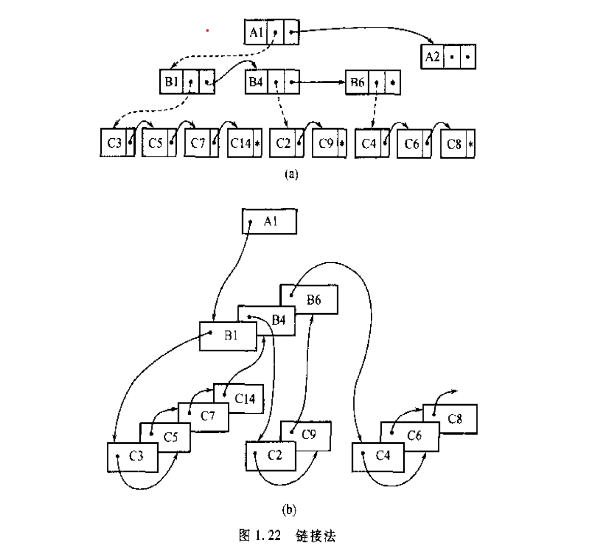
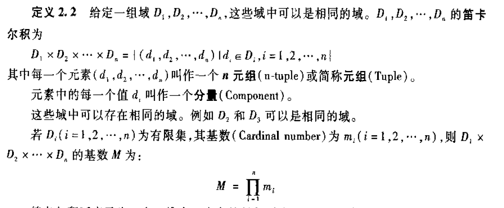
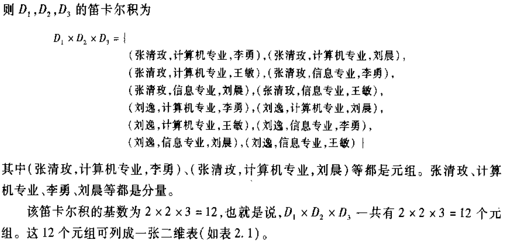
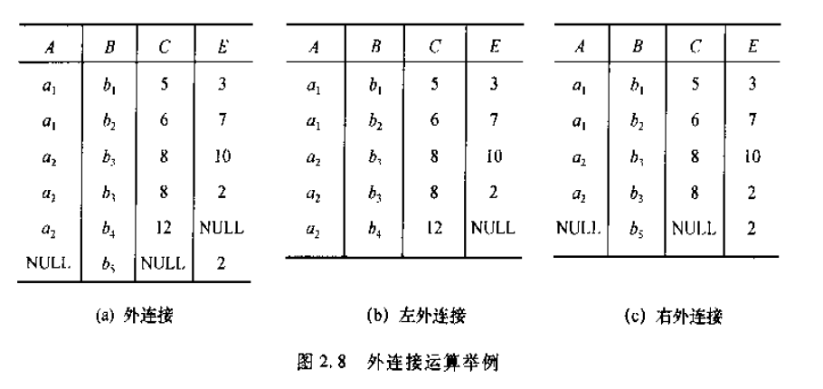
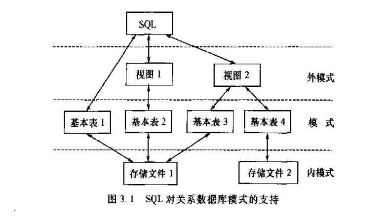

# 数据库系统概论（第四版）

1~3 数据库基本概念，4~8 三种重要数据库模型，9 数据库设计控制，10 数据库设计

# #

## 目录

=================基础===================

### 一 绪论

数据模型的组成要素，最主要的数据模型，数据库系统三级模式结构，数据库系统的主要组成部分

### 二 关系数据库

关系数据库概念：关系模型、关系代数

### 三 数据库标准语言

介绍sql语句，定义、查询、更新三部分

### 四 数据库安全性

全面讲解数据库系统安全性的技术和方法，着重讲解SQL存取控制功能

### 五 数据库完整性

实体完整性、参照完整性、用户定义完整性。完整性约束的定义方法、完整性检查机制、违约处理。

==============设计应用开发===============

### 六 关系数据理论

### 七 数据库设计

### 八 数据库编程

=================系统===================

### 九 关系查询与查询优化

### 十 数据库恢复技术

### 十一 并发控制

### 十二 数据库管理系统

=================新技术==================（选择看）

### 十三 数据库技术新发展

### 十四 分布式数据库系统

### 十五 对象关系数据库系统

### 十六 XML数据库

### 十七 数据仓库和练级分析处理

## 绪论

数据、数据库、数据库管理系统、数据库系统是4个基本概念

### 数据

数据不仅是数字，种类很多：文本、图形、图像、音频、视屏...。

具体定义为：描述事物的符号成为数据。描述事物的符号可以是文字、图形..。他们可以经过数字化存入计算机。

数据的表现形式不能表达其内容，需要经过解释，数据和关于数据的解释是不可分的。例如90，可以表示成绩，体重，长度...

### 数据库

是存放数据的仓库，只是这个仓库在计算机的存储设备上，数据按照一定格式存放。

数据库是长期存储在计算机内、有组织的、可共享的大量数据的集合。数据库中的数据 **按照一定的数据模型`组织、描述和存储`**。具有`较小的冗余度`、`较高的数据独立性`和`易扩展性`，并`可为各种用户共享`。

### 数据库管理系统

如何科学的组织和存储数据，如何高效的获取和维护数据就是数据库管理系统的任务。

数据库管理系统位于用户和操作系统之间的一层数据管理软件。主要功能如下：

#### 数据定义功能

数据定义语言（Data Definition Language,DDL），用户通过他可以方便的对数据库中的数据对象进行定义。

#### 数据组织、存储、管理

DBMS要`分类组织、存储、管理各种数据`,包括数据字典、用户数据、数据的存取路径等。要确定以何种`文件结构`和`存取方式`在存储级上组织这些数据,如何`实现数据之间的联系`。数据组织和存储的基本目标是提高存储空间利用率和方便存储，提供多种存取方法（如索引查找、Hash查找、顺序查找）等来提高存取效率。

#### 数据操纵功能

DBMS提供数据操作语言DML。用户可以使用DML操作数据，实现对数据的基本操作，如查询，插入，删除，修改等

#### 数据库事务管理和运行管理

数据库在建立、运用和维护时有DBMS统一管理、统一控制，保证数据的完整性、安全性、多用户对数据的并发使用及发生故障后的恢复

#### 数据库的建立和维护功能

包括：数据库初`始数据的输入、转换功能`，数据库的`转储、恢复功能`，数据库的`重组织功能`和`性能监视、分析功能`，这些功能通常由一些使用程序或管理工具完成

#### 其他功能

包括：DBMS与`网络中其他软件系统的通信功能`，一个DBMS与另一个DBMS或文件系统的`数据转换功能`，`异构数据库之间的互访和互操作功能`等

### 数据库系统

数据库系统指在计算机系统中引入数据库后的系统，一般指数据库、数据库管理系统（以及相关工具）、应用系统、数据库管理员构成。数据库的建立和维护还需专门的人员来完成，这些人是数据库管理员（DBA）


### 数据模型

模型，例如一张地图、飞机。**模型是对现实世界中某个对象特征的模拟和抽象。**

现实世界的人、物、活动、概念等用数据模型这个工具来抽象、表示和处理。

数据模型也是一种模型，他是现实世界数据特征的抽象。通俗的讲数据模型就是现实世界的模拟。

现有的数据库系统均是基于某种数据模型，**数据模型是数据库系统的核心和基础。**

数据模型：能比较真实的模拟现实世界、容易为人所理解、便于在计算机上实现。

如同在建筑设计和施工的不同阶段需要不同的图纸一样，开始实施数据库应用系统中也需要使用不同的数据模型：概念模型、逻辑模型、物理模型

**概念模型**

也称做信息模型、他是按用户的观点来对数据和信息建模，主要用于数据库设计

**逻辑模型**

包括：层次模型、网状模型、关系模型、面向对象模型、对象关系模型。它是按计算机系统的观点对数据建模，主要用于DBMS实现

**物理模型**

对数据最底层的抽象，描述数据在系统内部的表示方式和存取方法，在磁盘或 磁带上磁带上的存储方式和存取方法。物理模型的具体实现是DBMS的任务，数据库设计人员要了解和选择物理模型，一般用户则不必考虑物理级的细节

各种机器上实现的DBMS软件都是基于某种数据模型或者说支持某种数据模型。

人们首先将现实世界抽象为信息世界--》在把信息世界转换为机器世界。信息世界不依赖于具体的计算机系统，也不是某一个DBMS支持的数据模型，而是概念级别的模型。然后再把概念模型转换为计算机上某一DBMS支持的数据模型。

#### 数据模型组成要素

**数据结构**

数据结构描述数据库组成的对象以及对象的联系。数据结构描述的内容有两类：

- `对象的类型、内容、性质`，例如网状模型中的数据项、记录，关系模型中的域、属性、关系。
- `数据之间联系有关的对象`，例如网状模型中的系型

数据结构是刻画数据模型性质最重要的方面，所以通常用数据结构来命名数据模型，例如关系模型、网状模型、层次模型。

**数据操作**

数据操作值对数据库中各种对象（型）的实例（值）允许执行的操作的集合，包括操作及操作规则。 数据库主要有查询和更行两类操作

**数据的完整性约束条件**

数据的完整性约束是一组完整性规则。完整性规则是给定的数据模型中数据及其联系所具有的制约和依存规则，用以限定符合数据模型的数据库状态以及状态的变化，以保证数据的正确、有效、相容。

### 概念模型

概念模型应当有较强的语义表达能力，能够方便、直接的表达应用中的各种语义只是，还应当简单、清晰、易于用户理解。

信息世界的两个基本概念：

- `实体`：客观存在并可相互区别的事物称为实体，例如：一个学生
- `属性`：实体具有的某一特性称为属性，例如：（学号，姓名，性别，入学时间）
- `码(key)`：唯一标识实体的属性集称为码，例如，学生的学号
- `域`：属性的取值范围称为该属性的域，例如：性别的域(男，女)
- `实体型(Entity Type)`：具有相同属性的实体必然具有相同的特征和性质。用实体名机器属性名集合来抽象和刻画同类实体，称为实体型。例如：学生(学号，姓名，性别，入学时间)

**实体之间的联系** 1:1、1：n、n：n。

#### 概念模型的一种表示方法：实体-联系




### 常用数据模型

- 层次模型
- 网状模型
- 关系模型
- 面向对象模型
- 对象关系模型 层次模型和网状模型统称为非关系模型，现在基本不用非关系模型。

#### 层次模型

层次模型以树形结构表示实体以及实体之间的联系。

关系表示方法 邻接法



链接法，有两种：兄弟链接、层次链接



#### 关系模型

**数据结构**

- `关系`：一个关系通常对应一张表
- `元组`：表中的一行为一个元组
- `属性`：表中的一列为一个属性
- `码`：码键。表中的某个属性组，可以唯一确定一个元组
- `域`：属性的取值范围
- `分量`：元组中的一个属性值
- `关系模式`：对关系的描述，例如：关系名（属性1，属性2，属性3，...,属性n）

**数据操作和完整性约束**

主要操作为查询、插入、删除、更新。完整性约束三大类：实体完整性、参照完整性、用户定义完整性。数据操作为集合操作，操作对象和操作结果都是关系，即若干元组的集合。

**关系模型的存储结构**

关系模型中实体以及实体的联系都用表来表示。有的DBMS一个表对应一个文件，有的对应多个文件，自己设计表、索引等存储结构

### 数据库系统结构

数据库系统的结构可以有不同层次和不同角度

从数据库管理系统角度看，数据库系统通常采用三级模式结构

从用户角度看，数据库系统结构分为，单用户、主从式、分布式、客户/服务、浏览器/应用服务器/数据库服务器。这是`数据库系统外部体系结构`

#### 数据库系统模式概念

数据模型中有型(type)和值(value)概念。型指一类数据的结构和属性的说明，值是型的一个具体赋值。例如型 （学号，姓名，性别） 值（001，张三，男）

**模式(Schema)** 是数据库中全体数据的逻辑结构和特征的描述，她仅仅涉及到型的描述，不涉及具体的值。模式的一个具体值称为模式的一个实例(Instance)，同一个模式可以有多个实例。

例如：学生选课数据库模式中，2010年为一个实例，2011年一个实例

#### 数据库系统的三级模式：外模式、模式、内模式

多个外模式，一个模式，一个内模式


**外模式** 也称子模式或者用户模式，外模式是模式的子集，`他是数据库用户能够看见和使用的局部数据的逻辑结构和特征的描述`。他是保证数据库安全的一个有力措施

**模式** 也称逻辑模式，是数据库中全体数据的逻辑结构和特征的描述，`是所有用户的公共视图`。他是数据库模式的中间层，既不涉及数据的物理存储细节和硬件环境，也与具体的应用程序，开发工具和高级程序设计语言（C，COBOL，FORTRAN）无关

**内模式** 也称存储模式。一个数据库只有一个内模式，他是`数据的物理结构和存储方式的描述`，是数据在数据库内部的表示方式，例如记录的存储方式是堆存储、按照某个属性值升降序存储、按照属性值聚簇存储；索引按照什么方式组织，B+树还是Hash；数据是否压缩，是否加密；数据的存储记录结构有何规定，如定长结构或变长结构，一个记录能不能跨物理页存储等等。

## 关系数据库

### 关系数据结构及形式化定义

关系模型的3个要素：数据结构、关系操作集合、关系完整性约束。

#### 关系

关系模型的数据结构非常简单，只包含单一的数据结构-`关系`.

`从用户角度看`,关系模型中的数据结构是一张扁平的二维表。

关系模型中实体和实体间的各种联系均用单一的结构类型类表示。关系模型建立在集合代数的基础之上，从集合论角度描述关系数据结构的定义：域、笛卡尔积、关系

**域**

域是一组具有相同数据类型的值的集合。例如，自然数、整数，{0，1}、大于100的正整数

**笛卡尔积**



笛卡尔积可表示一个二维表。表中每一行对应一个元组，表中每一列的值来自一个域。

例如：




**关系**

关系是笛卡尔积的有限子集，所以关系也是一个二维表，表的每行对应一个元组，表的每列对应一个域。由于域可以相同，为了加以区分，必须对每列起一个名字，称为属性。

如果关系中的某一`属性组`的值能够唯一地标识一个元组，那么该属性称为`候选码`

如果有多个候选码，选择其中一个为`主码`。候选码的所有属性称为`主属性`。最简单情况下候选码只包含一个属性。

极端情况所有属性为候选码，称为`全码`。

关系可以有三种类型：基本关系(又叫基本表或基表)、查询表、视图表。

- 基本表是实际存在的表，它是实际存储数据的逻辑表示
- 查询表是查询结果对应的表
- 视图表是由基表或者其他视图表导出的表，是虚表，不对应实际存储的数据。

关系有6条性质

- 列是同质的，就是每一列中的分量（元组中的一个属性值）是统一类型的数据，来自同一个域
- 不同列可以来自同一个域，其中的每一列为一个属性，属性要给予不同属性名
- 列的顺序无所谓
- 任意两个元组的候选码不能相同
- 行的顺序无所谓
- 分量必须取原子值，就是每一个分量必须是不可分的数据项

关系模型要求关系必须是规范化的，即关系必须满足一定的规范条件。规范化的关系成为范式（第一、二、三、四、五范式）

#### 关系模式

关系数据库中要区分型和值。关系模式是型，关系是值。关系模式是对关系的描述。

### 关系操作

#### 基本关系操作

关系模型中常用操作包括`查询(Query)`和`插入(Insert)、删除(Delete)、修改(Update)`两大部分。

查询是操作中最主要部分。可以分为：`选择（Select）、投影(Project)、连接(Join)、除(Divide)、并（Union）、差(Except)、交(Intersection)、笛卡尔积`等

其中`选择、投影、并、差、笛卡尔积`是5中基本操作，其他操作可以由基本操作来定义和导出，就像乘法可以用加法来定义和导出一样。

关系操作的特点是集合操作方式，即操作的对象和结果都是集合

### 关系的完整性

实体完整性、参照完整性、用户定义的完整性。实体完整性、参照完整性被称为关系的两个不变性，应该有关系系统支持。用户定义的完整性是应用领域要遵循的约束条件，体现具体领域中的语义约束。

#### 实体完整性

若属性（一个或一组属性）A是基本关系的主属性，则A不能取空值。

#### 参照完整性

定义一：设F是基本关系R的一个或一组属性，**但不是R的码**(就是不能唯一标识R的一个元组)。K是基本关系 **S的主码**。如果F和K相对应，那么F是R的`外码`。R为参照关系，S为被参照关系。

显然K和F必须定义在同一个域（属性的取值范围称为该属性的域）上。

定义二：R中F上的值必须为：空值或者等于S中某个元组的主码值

#### 用户定义完整性

用户自定义例如：某个属性取值在10~25之间的整数

### 关系代数

关系代数一种抽象的查询语言，它用关系的运算来表达查询。

任何一种运算都是将一定的运算符作用于一定的运算对象上，得到预期的结果。所以运算对象、运算符、运算结果是运算三大要素。

关系代数的运算对象是关系，运算结果也是关系。运算符主要包括4类：集合运算符、专门的关系运算符、算数比较符、逻辑运算符。


#### 传统集合运算

关系A和B都有n个属性，且相应属性取自同一个域，t是关系中的一个元组，运算结果为关系C

**并(Union)**

A υ B = C 具有n个属性 C中的元组既属于A也属于B

**差(Except)**

A - B = C 具有n个属性 C中元组属于A不属于B

**交(Intersection)**

A ∩ B = C 具有n个属性 C中元组属于A也属于B

**笛卡尔积**

A有n个属性,a个元组，B有m个属性，b个元组，运算之后有n+m个属性，包含a*b个元组

#### 专门的关系运算

包括选择、投影、连接、除等运算。

**选择(Select)**

又称为限制，在关系R中选择满足条件的元组

**投影(Projection)**

是从关系R中选择若干列属性组成新的关系，**是从列的角度进行的运算**

**连接(Join)**

他是从连个关系的笛卡尔积中选取属性间满足一定条件的元组

连接运算中最为重要和常见的两种连接：`等值连接、自然连接`

**等值连接**

他是从关系R和S的笛卡尔积中选取M,N属性值相等的那些元组

**自然连接**

是特殊的等值连接，它要求两个关系中进行比较的分量必须是相同的属性组，并且在结果中把重复的属性列去掉。一般连接是从行角度进行，自然连接不仅从行，还要取消重复的列。

**外链接**


R和S连个关系进行自然连接时，R中的某些元组可能在S中不存在公共属性上值相等的元组，从而造成R中的这些元组被舍弃了，同样S中的某些元组也能被舍弃,例如上面R中第4个元组，S中第5个元组。

把舍弃的元组也保存在结果关系中，而在其他属性上填空值，那么叫做`外链接`，如果只把左边R的元组保留叫做`左外连接`，如果只把右边S中元组保留叫做`右外连接`。



**除运算**（没看懂）

给定关系R(X,Y),S(Y,Z),其中X、Y、Z为属性组。R中的Y和S中的Y可以有不同的属性名，但必须出自相同的域集。

## 关系数据库标准语言SQL(Structured Query Language)

SQL是关系数据库的标准语言，集数据查询、数据操作、数据定义、数据控制功能于一体

### SQL基本概念

支持SQL的RDBMS同样支持数据库三级模式，外模式对应视图(View)和部分基本表(Base Table)，模式对应基本表，内模式对应存储文件(Stored File)



用户可用SQL对基本表和视图进行查询或其他操作，基本表和视图一样都是关系。

**基本表** 是本身独立存在的表，在SQL中一个关系就是一个基本表，一个或多个基本表对应一个存储文件，一个表可以有若干索引，索引页存放在存储文件中。

**视图** 是从一个或几个基本表导出的表，`它本身不独立存储在数据库中，数据库只存放视图的定义而不存放视图对应的数据`,这些数据仍存放在基本表中，视图概念上与基本表相同，用户可以在视图上再定义视图。

### 数据定义

关系数据库支持三级模式结构，其模式、外模式、内模式中的基本对象有表、视图、索引。因此SQL的数据定义功能包括模式定义、表定义、视图定义、索引定义

- 模式 Create|Drop Schema
- 表 Create|Drop|Alter Table
- 视图 Create|Drop View
- 索引 Create|Drop Index

SQL通常不支持模式定义修改，视图定义修改，索引定义修改，只能删除后重建。

#### 模式的定义与删除

CREATE SCHEMA <模式名> AUTHORIZATION <用户名>

如果没有指定模式名，那么模式名默认为用户名。

调用此命令必须拥有DBA授予的CRAETE SCHEMA权限

例如 CREATE SCHEMA "S-T" AUTHORIZATION WANG;

定义模式实际是定义了一个命名空间，在这个空间中可以进一步定义数据库对象，例如表、视图、索引等，用户可以在创建模式的同时在这个模式中进一步创建基本表、视图、定义授权

> CREATE SCHEMA <模式名> AUTHORIZATION <用户名> [<表定义语句> | <视图定义语句> | <授权定义语句>]

`DROP SCHEMA <模式名> [RESTRICT|CASCADE]`

CASCADE表示同时删除模式下的所有数据库对象

RESTRICT表示如果模式下定义了数据库对象（如表、视图等），不允许删除模式

#### 基本表的定义、删除、修改

##### 定义基本表

```
CREATE TABLE <TABLE_NAME> (
    <COLUMN_NAME_1> <DATA_TYPE> [列级完整性约束条件]，
    <COLUMN_NAME_2> <DATA_TYPE> [列级完整性约束条件]，
    ...
    [表级完整性约束]
    )；
例如
CREATE TABLE STUDENT
(
    SNO CHAR(9) PRIMARY KEY,//列级完整性约束SNO为主码
    SNAME CHAR(20) UNIQUE,//SNAME取唯一值
    );

CREATE TABLE COURSE
(
    CNO CHAR(4) PRIMARY KEY,
    CNAME CHAR(40),
    CPNO CHAR(4),
    CREDIT SMALLINT,
    FOREIGN KEY CPNO REFERENCES COUESE(CNO)
    //表级完整性，CPNO是外码，被参照表是COURSE,被参照列是CNO
    );
这里表明参照表和被参照表可以是同一个表

CREATE TABLE SC
(
    SNO CHAR(7),
    CNO CHAR(7),
    GRADE SMALLINT,
    PRIMARY KEY (SNO,CNO)，//主码由两个属性构成，必须作为表级完整性约束定义
    FOREIGN KEY SNO REFERENCES STUDENT(SNO),//表级约束SNO是外码，被参照表是STUDENT
    FOREIGN KEY CNO REFERENCES COURSE(CNO)//表级约束CNO是外码，被参照表是COURSE
    );
```

##### 数据类型

SQL中用数据类型来表示域，常见类型:CHAR、VARCHAR、INT、SMALLINT、NUMBERIC、REAL、DOUBLE、FLOAT、DATA、TIME。

##### 模式与表

每一个基本表都属于某一个模式，一个模式包含多个基本表。 定义表的时候有三种方式指定其所属模式：

- 表名前加模式名 例如：CREATE TABLE "S-T".Student(...)
- 创建模式时同时创建表
- 设置所属模式，这样创建表时，表名中不需要给出模式名

当创建表时若没有指定模式，那么系统根据搜索路径来确定所属的模式。

搜索路径一般为一组模式列表，RDBMS会使用模式列表第一个模式作为数据库模式名，若找不到模式名，则报错

##### 修改基本表

```
ALTER TABLE <表名>
(
    [ADD <新列明> <数据类型> [完整性约束]]
    [DROP <完整性约束> ]
    [ALTER COLUMN <列名> <数据类型>]
    )
```

##### 删除基本表

`DROP TABLE <表明> [RESTRICT|CASCADE]`

RESTRICT表示要删除的表不能被其他的表约束引用(如 CHECK、FOREIGN KEY等)，不能有视图、触发器、存储过程、函数等。

CASCADE 表示将有关联的全部删除

#### 索引的简历、删除

建立索引是加快查询速度的有效手段。用户可以根据实际情况，在基本表上建立一个或多个索引，来提供多种存取路径，加快查询速度。

系统在存取数据时会自动的选择合适的索引作为存取路径，用户不必也不能显示的选择索引

##### 建立索引

`CREATE [UNIQUE] [CLUSTER] INDEX <索引名> ON <表名> (<列名> [<次序>][,<列名>[<次序>]]...)`

索引可以建立在一列或者多列上，`次序`为索引的排列次序，可选ASC(升序)或者DESC(降序)，默认为ASC。

UNIQUE表示此索引的每一个索引值只对应唯一的记录

CLUSTER表示建立的索引是聚簇索引。聚簇索引指索引项的顺序与表中记录的物理顺序一致的索引组织。

**在最经常查询的列上建立聚簇索引可以提高查询效率。显然一个表上只能建立一个聚簇索引，建立聚簇索引后，该列上的数据更新，往往导致记录的物理顺序的变更，代价较大，所以经常更新的列不不宜建立聚簇索引**

##### 删除索引

**索引一旦建立，就由系统使用和维护他，不需要用户干预。建立索引是为了减少查询操作的时间，但如果数据增删改频繁，系统会话费许多时间来维护索引，从而降低查询效率。所以需要删除一些不必要的索引**

RDBMS的索引一般采用B+树、HASH索引。B+树具有动态平衡的有点，HASH具有快速查找的特点。索引是关系数据库的内部实现技术，属于内模式范畴

用户创建索引的时候可以定义索引是唯一索引、非唯一索引、聚簇索引。至于索引采用B+树还是HASH索引具体有RDBMS来决定。

### 数据查询

#### 选择表中的若干列

```
SELECT [ALL|DISTINCT] <目标表达式> [,<目标表达式>]...
FROM <表明或者视图> [,<表名或者视图>]...
[WHERE <条件表达式>]
[GROUP BY <列名1> [HAVING <>]]
[ORDER BY <列名2> [ASE|DESC]]
```

整个语句表示从FROM子句指定的基本表或者视图中找出满足条件的元组，在按SELECT子句的目标表达式选出元组的属性值形成结果

GROUP BY将结果按照<列名1>的值进行分组，该属性值相等的元组为一个组通常会在每组中作用聚集函数，如果GROUP BY带有HAVING子句，则只有满足指定条件的组才会输出

ORDER BY按照指定列的值以升序或者降序排列

SELECT语句可以完成简单的单表查询，也可以完成复杂的连接查询和嵌套查询

```
查询学生表，学名，学号
SELECT sname，sno FROM student；
查询学生表，所有列
SELECT * FROM student；
查询经过计算的值
SELECT sname，2020-sage FROM student；
查询结果的系名全部小写
SELECT sname，LOWER(sdept) FROM student；
```

#### 选择表中的若干元组

**删除重复的行**

投影到指定列之后，某些行可能变成相同的行了，通过DISTINCT取消他们 `SELECT DISTINCT sno FROM student；`

**查询满足条件的元组**

条件通过WHERE子句实现

常用查询条件

- 比较：=，>，<，>=，<=，!=，!>，!<，NOT + 上述运算符
- 确定范围：BETWEEN AND ， NOT BETWEEN AND
- 确定集合：IN ，NOT IN
- 字符匹配：LIKE，NOT LIKE
- 空值：IS NULL，IS NOT NULL
- 多重条件：AND，OR，NOT

**如果数据量较小的话，索引不一定加快查询速度，数据库可能还是全表扫描。这由查询优化器按照某些规则或估计执行代价来做出选择**

字符串匹配：

- % 表示任意长度字符串，例如a%b表示以a开头b结尾的字符串
- _ 表示任意单个字符，a_b表示a开头b结尾的任意长度为3的任意字符串

**一个汉字占连个字符的位置匹配一个汉字用`__` , 而不是`_`**

##### 聚集函数

SQL提供了许多聚集函数

- COUNT([DISTINCT|ALL] `*`)统计元组个数
- COUNT([DISTINCT|ALL] <列名>) 统计列中值得个数
- SUM([DISTINCT|ALL] <列名>) 计算一个列值得总和（必须是数值类型）
- AVG([DISTINCT|ALL] <列名>) 计算一列的平均值（必须为数值类型）
- MAX([DISTINCT|ALL] <列名>)求一列的最大值
- MIN([DISTINCT|ALL] <列名>)求一列的最小值

DISTINCT表示取消指定列中重复的行，默认为ALL

##### GROUP BY

将查询结果按某一列或者多列的值分组，值相等为一组。

**对查询分组是为了细化聚集函数的作用对象，如果为对查询结果分组，聚集函数将作用于整个查询结果，分组后将作用于每个组**

##### ORDER BY

按照某一列排序

#### 连接查询

上面都是针对一个表进行查询，若一个查询同时涉及两个以上成为连接查询。他是关系数据库最主要的查询，`包括：等值连接，自然连接，非等值连接，自身连接，外链接，复合条件连接查询等。`

**等值与非等值**

连接查询的WHERE子句用来连接两个表的条件成为`连接条件`，一般格式为：`[<表名1>.]<列名1> <比较运算符> [<表名2>.]<列名2>`

其中比较运算符主要有=,>,<,>=,<=,!=等

连接谓词还可以是`[<表名1>.]<列名1> BETWEEN [<表名2>.]<列名2> AND [<表名2>.]<列名3>`

当连接谓词为=时成为`等值连接`，其他为`非等值连接`

列名成为连接字段，连接字段必须是可比的，名称可以不同

**自身连接**

自身连接查询，通常对一个表设置两个别名。

**外链接**

```
SELECT STUDENT.sno,sname,sage
FROM STUDENT LEFT OUT JOIN SC ON(STUDENT.sno=SC.sno)
//也可以使用USING来去掉结果中重复的值
FROM STUDENT LEFT OUT JOIN SC USING(sno)
//右外链接使用RIGHT OUT JOIN
```

**复合条件连接**

上面连接查询,WHERE子句只有一个条件，如果有多个条件称为复合条件连接

```
SELECT STUDENT.sno,sname
FROM STUDENT,SC
WHERE STUDENT.sno=SC.sno AND SC.cno=2 AND SC.grade>90;

这个查询的优化可以：先从SC中挑选出cno=2 并且 grade>90的元组 ，再与STUDENT满足条件的元组进行连接得到最终结果
```

> 连接查询可以两个以上的的表进行连接

#### 嵌套查询

SQL中SELECT-FROM-WHERE称为一个查询块，将查询快放在另一个WHERE子句或者HAVING子句的查询称为`嵌套查询`

SQL允许多层嵌套查询。**但是子查询不可以使用ORDER BY,ORDER BY只能用于最终结果排序**

**带有IN的子查询**

嵌套查询中，子查询往往是一个集合，`IN`是最常用的谓词

**带有比较运算符的子查询**

带有比较运算符的子查询是指父查询与子查询之间用比较运算符进行连接，当确切知道内层查询返回的是单值时可以用`=,>,<,>=,<=,!=`等

**带有ANY(SOME)、ALL谓词的子查询**

子查询返回值为单值时可以用比较运算符，返回多值时要用ANY、ALL,使用ANY或ALL时，需要同时使用比较运算符：

- > ANY 大于子集某个值

- < ANY 小于子集某个值

- > ALL 大于子集所有值

- < ALL 小于子集所有值

- > = ANY 大于等于子集某个值

- <= ANY 小于等于子集某个值

- > = ALL 大于等于子集所有值

- <= ALL 小于等于子集所有值

- = ANY 等于子集中某个值
- = ALL 等于子集中所有制（通产更没有意思）
- != ANY 不等于子集某个值
- != ALL 不等于子集任何一个值

**带有EXISTS子查询**

带有EXISTS子查询不返回任何数据，只返回true或false ，如果子查询返回空则是false。

#### 集合查询

SELECT语句的查询结果为稽核，所以多个SELECT语句结果可以进行集合操作，主要为并`（Union）、差(Except)、交(Intersection)`

```
SELECT SNO
FROM SC
WHERE CNO=1
UNION|INTERSECT|EXCEPT
SELECT SNO
FROM SC
WHERE CNO>0
```

### 数据更新

#### 插入数据

SQL插入语句INSERT通常有两种方式，一种是插入元组，一种是插入子查询

```
INSERT INTO table_name [(<属性名1>，<属性名2>，<属性名3>...)]
VALUES (value1,value2,value3...);
//
INSERT INTO table_name [(<属性名1>，<属性名2>，<属性名3>...)]
子查询
```

#### 修改数据

条件可以是子查询

```
UPFATE table_name
SET <列名>=<表达式> [，<列名>=<表达式>]
[WHERE <条件>]
```

#### 删除数据

条件可以是子查询

```
DELETE
FROM table_name
[WHERE <条件>]
```

### 视图

视图是从一个或多个基本表(或者视图)导出的表。数据库中只存放视图的定义。如果基本表有变动那么视图查询的数据也会发生变化。视图类似于一个窗口，透过它可以只看到用户关心的数据。

#### 视图定义

**建立视图**

```
CREATE VIEW <视图名> [(<列名> [,<列名>]...)]
AS <子查询>
[WITH CHECK OPTION]
```

子查询可以是任意的复杂的SELECT语句，**但是不允许有ORDER BY、DISTINCT**

WITH CHECK OPTION 表示对视图进行UPDATE,INSERT,DELETE操作时要保证更新、插入、删除时元组要满足视图定义的子查询

视图的列名，如果没有指定那么，列名为子查询的所有列名

有些情况不许指定列名
- 某个目标列不是单纯的属性名，而是聚集函数或者表达式
- 多表连接时选出了几个同名的列
- 需要在视图中为某个列启用一个新的名字

例如：
```
CREATE VIEW v_student
AS
SELECT sno,sname,sapge
FROM student
WHERE sdept='is'
这里v_student的列名为sno,sname,sapge
```

**CREATE VIEW的时候只是创建视图的定义，并不执行其中的SELECT语句**，只有对视图查询是，才会从基本表中查询数据

```
CREATE VIEW v_student
AS
SELECT sno,sname,sage
FROM student
WHERE sdept='is'
WITH CHECK OPTION
```
如果在视图上的插入、修改、删除，RDBMS都会自动带上sdept='is'条件

```
CREATE VIEW V_student(sno，sname，sbirth)
AS
SELECT sno,sname,2010-sage
FROM student
```
sbirth是虚拟列，它不是实际存在于基本表中。这个视图叫`带表达式的视图`

**视图查询与基本表查询一样，视图的更新、插入、删除最终是转化为基本表的操作**


## 数据库安全性
