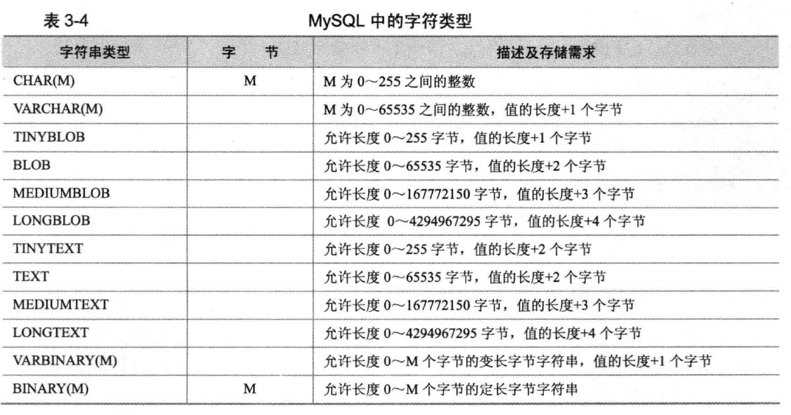
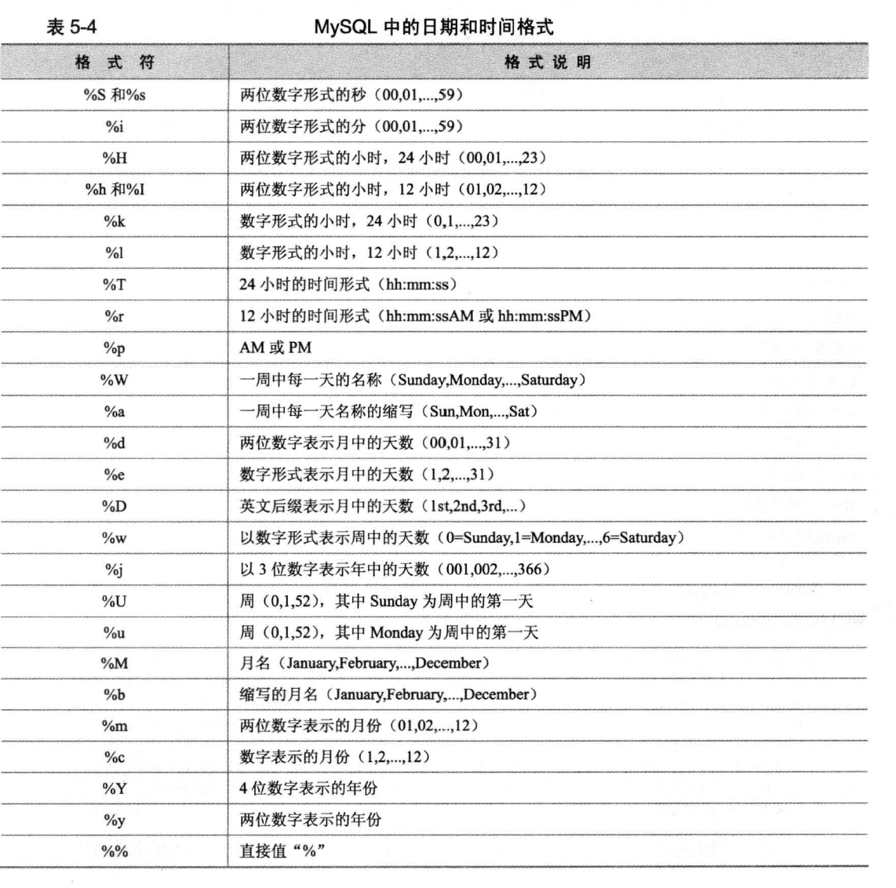
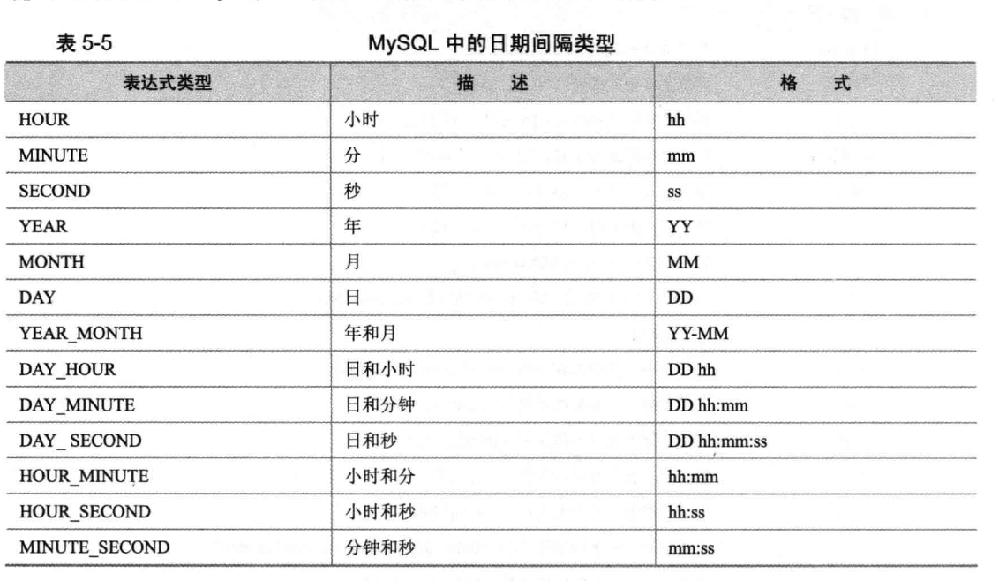
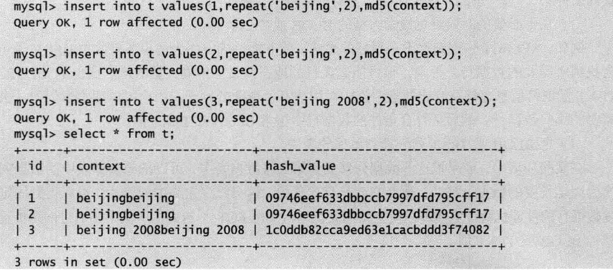

# 深入浅出MYSQL

# 目录

-----------基础篇-----------

## 安装与配置

## SQL基础

## mysql支持的数据类型

## MySQL中运算符

## 常用函数

## 图形化工具

-----------开发篇-----------

## 表类型（存储引擎的选择）

## 选择合适的数据类型

## 字符集

## 索引的设计与使用

## 视图

## 存储过程和函数

## 触发器

## 事务控制和锁定语句

## SQL安全问题

## SQL Mode及相关问题

## Mysql分区

-----------优化篇-----------

## SQL优化

## 优化数据库对象

## 优化Mysql Server

## 磁盘I/O问题

## 应用优化

-----------管理维护篇-----------

## MYSQL高级安装和升级

## MYSQL中常用工具

## MYSQL日志

## 备份与恢复

## MYSQL权限与安全

## MYSQL常见问题与技巧

-----------架构篇-----------

## MYSQL复制

## MYSQL Cluster

## 高可用架构

> 前言：pg追求功能完美，所以性能不如mysql mysql提供多种存储引擎，他们各有特点，实际应用如何选择，性能如何诊断和优化，数据安全方面注意什么，mysql的锁机制有什么特点，如何减少锁冲突，提高并发度。

# 基础篇

## 安装与配置

配置文件`ubuntu 下/etc/mysql/mysql.conf.d/mysql.cnf`

## SQL基础

SQL分为3类

1. DDL：数据定义语言，这些语句用来定义不同的数据段、数据库、表、列、索引、视图等常用create、drop、alter等
2. DML：数据操作语言，用于添加、删除、更新、查询数据库记录，并检数据完整性，常用select、update、delete、insert
3. DCL：数据控制语句，用于控制不同数据直接的许可和访问级别，定义数据库、表、字段、用户的访问权限和安全级别，常用grant、revoke等

### DDL

#### 数据库

> 查看已有数据库`show databases`<br>
> 创建数据库`create database db_name`<br>
> 使用数据库`use db_name`<br>
> 查看数据库下有哪些表`show tables`<br>
> 删除数据库`drop database dbname`

#### 表

> 创建表<br>
> `create table table_name （column_name data_type constrains, ..., constrains`<br>
> 查看表定义`descibe|desc table_name`<br>
> 删除表`drop table table_name`<br>
> 修改字段<br>
> `alter table table_name modify [column] column_definition [first|after column]`例如：`alter table t1 modify name varchar(32)`<br>
> 增加字段<br>
> `alter table table_name add [column] column_definition [first|after column_name]`例如`alter table t1 add column new_name varchar(32)`<br>
> 删除字段<br>
> `alter table table_name drop [column] column_name`例如`alter table t1 drop column tmp_age`<br>
> 修改字段名<br>
> `alter table change [column] old_name column_definition [first|after column_name]`例如：`alter table change column name name_change varchar(64)`<br>
> 修改表名 `alter table table_name rename new_table_name`

### DML

主要insert、update、delete、select

#### 插入记录

```
insert into table_name [(field1,field2,field3,fieldn)]
values (value1,value2,value3,valuen),
(value1,value2,value3,valuen),
```

#### 更新记录

```
update table_name set field1=value1,field2=value2 [where condition]
更新两个表
update table1 table_alias,table2 table2_alias set a.sal=a.sal*b.deptno,b.deptname=a.ename where a.deptno=b.deptno
```

#### 删除记录

`delete from table_name [where condition]`

#### 查询记录

排序`select * from table_name order by field1[desc],fild2[desc],...`

显示一部分数据`select [limit start,row_count]` start表示起始位置，默认为0，只需给出要显示的行数。

聚合操作

```
select [field1,field2,fieldn] fun_name
from table_name
[where condition]
[group by field1,field2,fieldn]
[with rollup]
[having condition]
group by按照指定属性分组后再进行聚合函数操作
with rollup 表明是够对分类聚合后的结果在进行汇总
having对分类后的结果再次进行条件过滤
```

链接

```
自然连接
select t1.field1,t2.field1 from t1,t2 where t1.field1=t2.field1
外链接
select field1,field2 from t1 left join t2 on t1.field1=t2.field1
```

子查询

```
select * fom t1 where t1.field1 in (select field2 from t2 where field2>100)
如果只有一条记录 可以使用=
```

记录联合

```
将两个表的数据查询出来后合并到一起
常用union 和 union all
union all会把两个几个并集后去除重复的元组
select field1 form table1
union|union all
select field1 from table2
```

### DCL

`grant select,insert on db_name.* to 'user1'@'localhost' identified by 'password'`

## MySQL支持的数据类型

### 数值类型


类型名称后面小括号可以指定显示宽度，例如`int(5)`表示宽度小于5的时候数字前面填满宽度，如果不显示指定宽度默认为`int(11)`,一般配合`zerofill`，即用0填充。

`alter table t1 modify id1 int zerofill`这样就可以用0填充了

所有整数类型都有可选属性 `unsigned`(无符号)

整数类型还有一个属性 `auto_increment` 一般配合`primary key not null`使用

对于小数有两种：浮点数和定点数。浮点数有`float`和`double`，定点数为`decimal`，**定点数在MySQL内部已字符串形式存放**，他比浮点数更精确，适合用来表示货币等精度高的数据

decimal(10,3)10表示总位数为10，3表示小数位数为3位，那么整数位数不能超过7位，1234567.123123可以插入，但是12345678.12312312不可插入，插入时小数位数会自动采用四舍五入方式截断

### 日期类型

```
insert into table
values ('2010-9-3 12:12:20'),
('2010/9/3 12:12:20'),
('20100903121020'),
(20100903121020)
上面数据一致
```

### 字符串类型



#### char和varchar

都用来保存较短的字符串，检索时char类型后面的空格自动删除，varchar会保存后面的空格

#### binary和varbinary

类似于char和varchar，但是他们保存的是二进制字符串不包含非二进制字符串。

#### enum类型

他的值范围需要在创建表时通过枚举方式显示指定`create table table_name (gender enum('M','F'))`

对于1~255个成员，用一个字节存储；对于255~65535两个字节存储，最多成员数65535

#### set类型

类似于enum，是一个字符串对象，可以包含0~64个成员，成员数不同存储方式也不同

- 1~8 1字节
- 9~16 2字节
- 17~24 3字节
- 25~32 4字节
- 33~64 8字节

set类型可以一次选取多个成员，enum只能选一个 `insert into t2 values ('a,b'),('c');` `update t2 set se=('a,c,b');`

## MySQL中的运算符

- = 等于
- <>或!= 不等于
- <=> NULL安全的等于
- < 小于
- <= 小于等于
- > 大于
- >= 大于等于
- between 存在于指定的范围
- in 存在于指定集合
- is null 为null
- is not null 不是null
- like 通配符匹配
- regexp或rlike 正则表达式匹配
- NOT 或者 ! 逻辑非
- AND 或者 && 逻辑与
- OR 或者 || 逻辑或
- XOR 逻辑异或
- & 位与
- | 位或
- ^ 位异或
- ~ 位取反
- << 位右移
- >> 位左移

## 常用函数

### 字符串函数

- concat(s1,s2...sn) 连接字符串
- insert(str,x,y,instr)将str第x位开始，y个字符长的字符串替换为instr，`可以当做替换使用`
- lower(str) 所有字符变为小写
- upper(str) 所有字符变为大写
- left(str,x) 返回字符串最左边x个字符
- right(str,x) 返回字符串最右边x个字符
- lpad(str,n,pad) 用字符串pad对str最左边填充，知道长度为n个字符长度
- rpad(str,n,pad) 用字符串pad对str最右边填充，知道长度为n个字符长度
- ltrim(str) 去掉str左侧的空格
- rtrim(str) 去掉str右侧的空格
- repeat(str,x) 返回str重复x次的结果
- replace(str,a,b) 用b替换str中的a
- strcmp(s1,s2) 比较字符串s1,s2
- trim(str) 去掉str开头和结尾的空格
- substring(str,x,y) 返回str中从x位到开始的y个字符长度的字符串

### 数值函数

- abs(x) 返回x的绝对值
- ceil(x) 返回大于x的最小整数
- floor(x) 返回小于x的最大整数
- mod(x,y) 返回x/y的模
- rand() 返回0~1之间的随机数
- round(x,y) 返回参数x的四舍五入的有y位小数的值
- truncate(x,y) 返回数字x截断为y位小数的结果

### 日期和时间函数

- curdate() 返回当前日期
- curtime() 返回当前时间
- now() 返回当前日期和时间
- unix_timestamp(date) 返回日期date的unix时间戳`select unix_timestamp(now());=> 1489322588`
- from_unixtime 返回unix时间戳的日期值 `select from_unixtime(1)=>1970-01-01 08:00:01 `
- week(date) 返回日期为一年中的第几周
- year(date) 返回日期的年份
- hour(time) 返回时间的小时
- minute(time) 返回时间的分钟
- monthname(date) 返回日期的月份名
- date_format(date,fmt) 按照fmt格式化日期
- date_add(date,interval expr type) 一个时间加上一个时间间隔的时间值
- datediff(expr,expr2)





```
select now() current,date_add(now(),interval 31 day) after31days
+---------------------+---------------------+
| current             | after31days         |
+---------------------+---------------------+
| 2017-03-12 20:51:02 | 2017-04-12 20:51:02 |
+---------------------+---------------------+
```
时间是以字符串形式存放的 select replace(now(),'-','/');


### 流程函数

- if(value,t f) 如果value是真返回t否则返回f
- ifnull(value1，value2)如果value1是null则返回value2
- case when [value] then [result] ... else [default] end 如果value是真返回result否则返回default
- case [expr] when [value] then [result] ... else [default] end 如果expr等于value，返回result 否则返回default

```sql
select if(salary>2000,'high' 'low') from salarys;
select ifnull(salary,0) from salarys;
select case when salary<=2000 then 'low' else 'high' end from salarys;
select case salary when 1000 then 'low' when 2000 then 'mid' when 3000 then 'high' end from salarys;
```

### 其他常用函数
- database() 返回当前数据库名
- version() 返回当前数据库版本
- user() 返回当前登录用户名
- inet_ation(IP) 返回ip地址的数字表示
- inet_ntoa(num) 返回数字代表的ip
- password(str) 返回str的加密版本
- md5(str) 反馈字符串的md5值


# 开发篇

## 表类型（存储引擎）的选择

和大多数数据库不同，mysql存在存储引擎的概念，针对不同的存储需求，可以选择最优的存储引擎

### MySQL存储引擎概述

用户可以根据应用的需要选择如何存储和索引数据，是否使用事务等。MySQL默认支持多种存储引擎，以适应不同领域的数据库应用需要，用户甚至可以按照自己的需要定制和使用自己的存储引擎。

MySQL支持的存储引擎包括:MyISAM、InnoDB、BDB、MEMORY、MERGE、EXAMPLE、NDB Cluster、ARCHIVE、CSV、BLACKHOLE、FEDERATED等

`InnoDB、BDB`提供事务安全表，其他事务都是非事务安全表

`show engines`或者`show variables like 'have%'`查看当前数据库支持的存储引擎

修改当前表的存储引擎`alter table table_name engine=innodb`;


#### MyISAM

不支持事务、也不支持外键。优势是访问速度快，对事务完整性没有要求或者以SELECT、INSERT为主的应用基本上都可以使用这个引擎来创建表

MyISAM在磁盘上存储成3个文件，其文件名都和表名相同，但扩展名分别是：
- .frm(存储表定义)
- .MYD(MYData，存储数据)
- .MYI(MYIndex，存储索引)

数据文件和索引文件可以放置在不同的目录，平均分布IO，获得更快的速度

要指定索引文件和数据文件的路径，需要在创建表的时候通过DATA DIRECTORY和INDEX DIRECTORY语句指定。文件路径需要是绝对路径，并且具有访问权限。

MyISAM类型的表可能会损坏，通过`check table` 来检查MyISAM表的健康

MyISAM的表还支持3种不同的存储格式，
- 静态表
- 动态表
- 压缩表

**静态表** 是默认存储格式。静态表中的字段都是非变长字段，每个记录都是固定长度，这种方式的优点是存储非常迅速，容易缓存，出现故障易恢复；缺点是占用空间比动态表多。**静态表的数据在存储时会按照列的宽度定义补足空格，但是在应用访问的时候并不会得到这些空格。如果本来需要保存的内容就有空格，在返回结果时也会被去掉**

**动态表** 包含变长字段，记录不是固定长度，优点是占用空间小，但是频繁的更新和删除记录会产生碎片，需要定期的执行optimiz table或myisamchk-r来改善性能

**压缩表** 由myisampack工具创建，占用非常小的磁盘空间。每个记录是被单独压缩，所以只有非常小的访问开支。

#### InnoDB

##### 自动增长列

InnoDB中自动增长列可以手工插入，但是插入的值是空或者0，则实际插入的是自动增长后的值。默认初始值为1

`select last_insert_id()`查看当前线程最后插入记录使用的值

**对于InnoDB自动增长列必须是索引，如果是组合索引，也必须是组合索引的第一列**

##### 外键约束

MYSQL支持外键的存储引擎至于InnoDB

在导入多个表的数据的时候，如果需要忽略表之前的导入顺序，可以暂时关闭外键约束的检查；同样在执行`LOAD DATA`和`ALTER TABLE`操作的时候，可以通过暂时关闭外键约束来提高处理速度，

`SET FOREIGN_KEY_CHECKS=0`来关闭外键检查，恢复时只需把值改为1

##### 存储方式

InnoDB存储表和索引有一下两种方式
- 使用共享表空间存储，这种方式创建的表的表结构保存在.frm文件中，数据和索引保存在innodb_data_home_dir和innodb_data_file_path定义的表空间中，可以是多个文件
- 使用多表空间存储，表的表结构仍然保存在.frm文件中，每个表的数据和索引单独保存在.ibd中。如果是个分区表，则每个分区对应单独的.ibd文件


#### MEMORY

使用存在于内存中的内容来创建表。每个MEMORY表只实际对应一个磁盘文件，格式是.frm。表的访问极快，因为数据存放在内存中，并且默认使用HASH索引，服务关闭数据丢失。

在启动MYSQL服务时候使用--init--file选项，把insert into ... select 或load data infile 这样的语句放入这个文件中，就可以在服务启动时候从持久稳固的数据源装载表

服务器需要足够的内容来维持统一时间使用的MEMORY表，当不再需要时通过删除数据，或者删除表来释放空间

MEMORY可以放置的数据大小，受max_heap_table_size限制，默认为16MB，此外在定义MEMORY表的时候，可以通过MAX_ROWS来限制表的最大行数


### 如何选择合适的存储引擎

- MyISAM。如果应用主要以读操作和插入操作为主，只有很少的更新和删除操作，并且对事务的完整性，并发性要求不是很高。
- InnoDB。用于事务处理应用程序，支持外键。如果应该对事务的完整性有比较高的要求，在并发条件下要求数据的一致性，数据操作除了插入和查询以外，还包括更新，删除。InnoDB除了有效的降低了由于删除和更新导致的锁定，还是可以确保事务的完整提交和回滚。对于类似计费系统或者财务系统等对数据准确性要求比较高的系统，InnoDB比较适合
- MEMORY，缺陷是表大小有限制，数据库异常或终止后数据丢失，对于更新不太频繁的小表
- MERGE，突破了单个MyISAM标的大小的限制，并且通过将不同的表分布在多个磁盘上，可以有效的改善MERGE表的访问效率，对于数据仓库等VLDB环境十分适合


## 选择合适的数据类型

### char和varchar
他们都用来存储字符穿，但是保存和检索的方式不同

char处理速度比varchar快，但是浪费存储空间。对于长度变化不大并且对查询速度有比价高的要求的数据可以考虑使用char类型来存储

不同存储引擎对char和varchar的使用原则
- MyISAM存储引擎：使用char
- MEMORY：两者最终都会被当做char来处理
- InnoDB：varchar

### TEXT和BLOB
BLOB存储二进制数据，比如照片；TEXT只能保存字符数据，比如文章日记。TEXT和BLOB都有不同类型，应用中应该选择能够满足需求的最小类型

**TEXT和BLOB常见问题**
- 他们的值会引起性能问题，特别是执行大量的删除操作时。删除操作会在数据表中留下很大的"空洞"，以后填入这些空洞的记录在插入的性能上会有影响。**为了提高性能。应当定期使用OPTIMIZ TALBE进行碎片整理**，`当删除一条记录时，表的数据文件大小并没有变小，进行碎片整理后才回收"空洞"`
- 使用合成的索引来提高大文本字段（TEXT或者BLOB）的查询性能。这种技术只能用于精确匹配的查询，对于`<，>等没有意义`，可以使用MD5()函数生成散列值，或者sha1()或crc32()，或者使用自己的应用程序逻辑来生成散列值。
- 在不必要的时候避免检索大型的BLOB和TEXT
- 把BLOB和TEXT分离到单独的表中。可以减少主表的碎片，可以得到固定长度数据行的性能优势。还可以使得主表在运行select * 查询时避免网络传输大量的BOLB和TEXT

### 浮点数和定点数
定点数实际是以字符串形式存放，可以精确的保存数据


## 字符集

### MySQL字符集的设置

有4个级别的默认设置：服务器级，数据库级，表级，字段级

#### 服务器级
- 配置文件：my.cnf 'character-set-server=utf8'
- 启动服务时：mysqld --character-set-server=utf8
- 编译时 cmake . -DDEFAULT_CHARSET=utf8

#### 数据库级

`CHARACTER SET [=] charset_name`

#### 表级

```
create table table_name
(...)
engine=innodb default charset=utf8 collate=utf8_bin
```

## 索引的设计和使用

- 最适合建立索引的列是出现在where子句中的列，或链接子句指定的列
- 使用唯一索引，考虑某列中值得分布，索引列的基数越大索引效果越好，例如搜索出生日期的列具有不同的值，很容易区分各行，二性别列，只有M和F，则此列索引没有多大意义，因为搜索出来的值都会得出大约一半的行
- 使用短索引。如果对字符串列进行索引，应该指定一个前缀长度，只要有可能就应该这样做，例如，有一个char(200)如果前10个或前20个字符内，多数值是唯一的，那么就不要对整个列进行索引。这样可以使查询更快，较小的索引设计磁盘的IO较少，较短的比起来更快，更为重要的是，对于较短的值，索引高速缓存可以存放更多的键值
- 利用最左前缀。在创建一个n列的索引时，实际创建了MySQL可利用的n个索引。多列索引可起几个索引的作用，因为可利用索引中最左边的列集来匹配行。
- 不要过度索引。每个索引要占用额外的磁盘空间，降低写操作性能。修改表的内容时，索引必须进行更新，有时候可能会重构
- 对于InnoDB的表，记录会默认按照一定的顺序保存，如果有明确定义的主键，则按照主键顺序保存，如果没有主键，但有唯一索引，那么久按照唯一索引的顺序保存，如果既没有主键又没有唯一索引，那么表中会自动生成一个内部列。按照主键或者内部列进行访问时最快的，所以innodb表尽量自己制定主键，当表中几个列都是唯一时，选择最长作为条件的列作为主键，主键应选择较短的数据类型，可以有效减少磁盘占用，提高索引缓存效果

### BTREE索引和HASH索引

hash索引特点
- 只用于= 和!=的比较
- 优化器不能使用hash索引来加速order by操作
- mysql不能确定两个值之间大约有多少行，如果将一个MyISAM表改为HASH索引的MEMORY表，会影响一些查询的执行效率
- 只能使用整个关键字来搜索一行

BTREE：<,>,<=,>=,between,!=,like

## 视图
