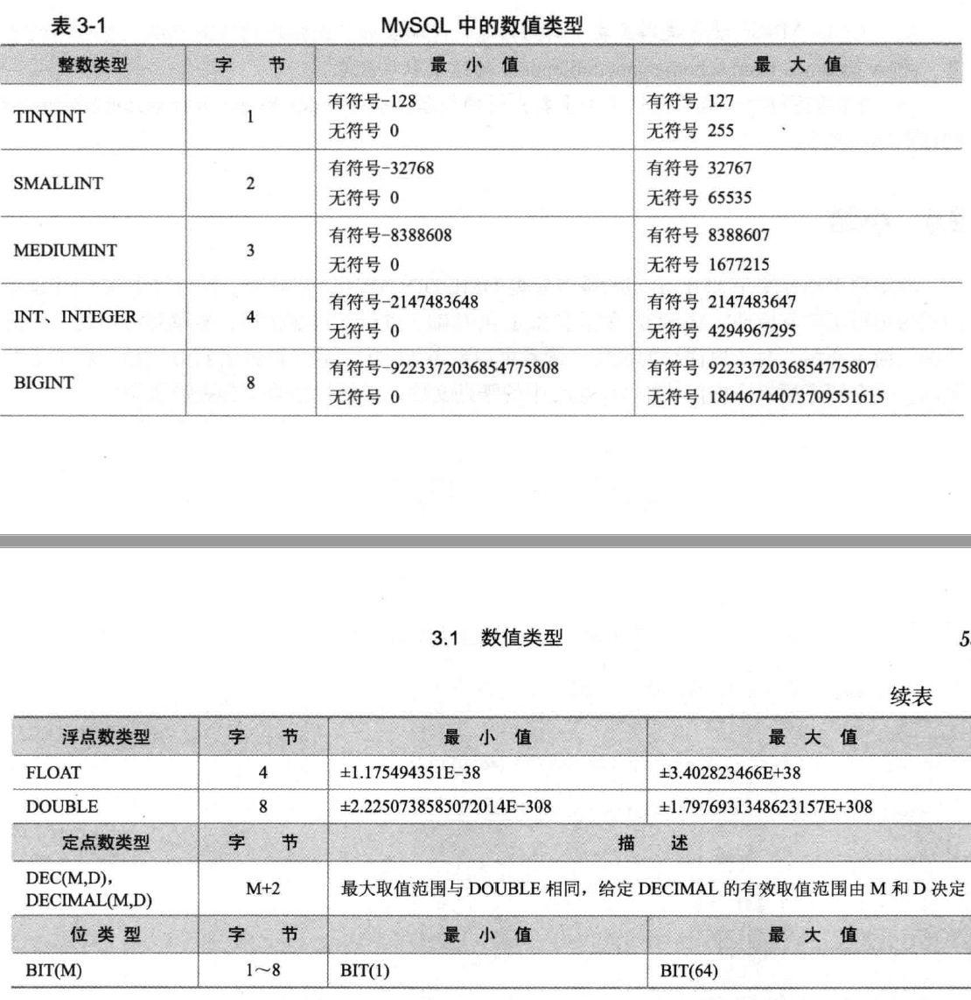
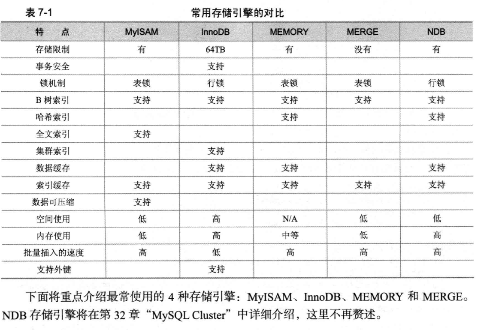
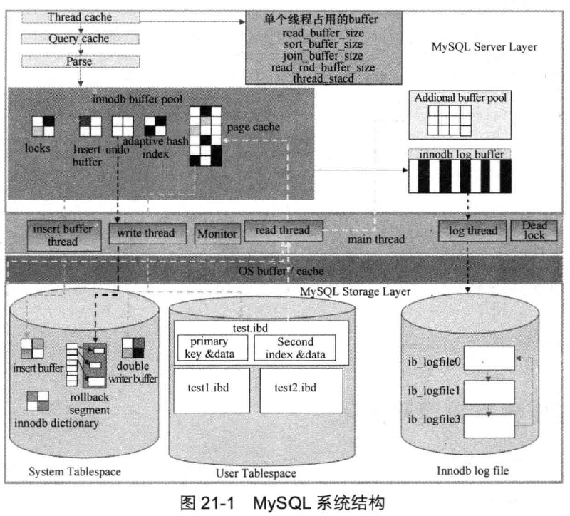

# 深入浅出MYSQL

# 目录

-----------基础篇-----------

## 安装与配置

## SQL基础

## mysql支持的数据类型

## MySQL中运算符

## 常用函数

## 图形化工具

-----------开发篇-----------

## 表类型（存储引擎的选择）

## 选择合适的数据类型

## 字符集

## 索引的设计与使用

## 视图

## 存储过程和函数

## 触发器

## 事务控制和锁定语句

## SQL安全问题

## SQL Mode及相关问题

## Mysql分区

-----------优化篇-----------

## SQL优化

## 优化数据库对象

## 优化Mysql Server

## 磁盘I/O问题

## 应用优化

-----------管理维护篇-----------

## MYSQL高级安装和升级

## MYSQL中常用工具

## MYSQL日志

## 备份与恢复

## MYSQL权限与安全

## MYSQL常见问题与技巧

-----------架构篇-----------

## MYSQL复制

## MYSQL Cluster

## 高可用架构

> 前言：pg追求功能完美，所以性能不如mysql mysql提供多种存储引擎，他们各有特点，实际应用如何选择，性能如何诊断和优化，数据安全方面注意什么，mysql的锁机制有什么特点，如何减少锁冲突，提高并发度。

# 基础篇

## 安装与配置

配置文件`ubuntu 下/etc/mysql/mysql.conf.d/mysql.cnf`

## SQL基础

SQL分为3类

1. DDL：数据定义语言，这些语句用来定义不同的数据段、数据库、表、列、索引、视图等常用create、drop、alter等
2. DML：数据操作语言，用于添加、删除、更新、查询数据库记录，并检数据完整性，常用select、update、delete、insert
3. DCL：数据控制语句，用于控制不同数据直接的许可和访问级别，定义数据库、表、字段、用户的访问权限和安全级别，常用grant、revoke等

### DDL

#### 数据库

> 查看已有数据库`show databases`<br>
> 创建数据库`create database db_name`<br>
> 使用数据库`use db_name`<br>
> 查看数据库下有哪些表`show tables`<br>
> 删除数据库`drop database dbname`

#### 表

> 创建表<br>
> `create table table_name （column_name data_type constrains, ..., constrains`<br>
> 查看表定义`descibe|desc table_name`<br>
> 删除表`drop table table_name`<br>
> 修改字段<br>
> `alter table table_name modify [column] column_definition [first|after column]`例如：`alter table t1 modify name varchar(32)`<br>
> 增加字段<br>
> `alter table table_name add [column] column_definition [first|after column_name]`例如`alter table t1 add column new_name varchar(32)`<br>
> 删除字段<br>
> `alter table table_name drop [column] column_name`例如`alter table t1 drop column tmp_age`<br>
> 修改字段名<br>
> `alter table change [column] old_name column_definition [first|after column_name]`例如：`alter table change column name name_change varchar(64)`<br>
> 修改表名 `alter table table_name rename new_table_name`

### DML

主要insert、update、delete、select

#### 插入记录

```
insert into table_name [(field1,field2,field3,fieldn)]
values (value1,value2,value3,valuen),
(value1,value2,value3,valuen),
```

#### 更新记录

```
update table_name set field1=value1,field2=value2 [where condition]
更新两个表
update table1 table_alias,table2 table2_alias set a.sal=a.sal*b.deptno,b.deptname=a.ename where a.deptno=b.deptno
```

#### 删除记录

`delete from table_name [where condition]`

#### 查询记录

排序`select * from table_name order by field1[desc],fild2[desc],...`

显示一部分数据`select [limit start,row_count]` start表示起始位置，默认为0，只需给出要显示的行数。

聚合操作

```
select [field1,field2,fieldn] fun_name
from table_name
[where condition]
[group by field1,field2,fieldn]
[with rollup]
[having condition]
group by按照指定属性分组后再进行聚合函数操作
with rollup 表明是够对分类聚合后的结果在进行汇总
having对分类后的结果再次进行条件过滤
```

链接

```
自然连接
select t1.field1,t2.field1 from t1,t2 where t1.field1=t2.field1
外链接
select field1,field2 from t1 left join t2 on t1.field1=t2.field1
```

子查询

```
select * fom t1 where t1.field1 in (select field2 from t2 where field2>100)
如果只有一条记录 可以使用=
```

记录联合

```
将两个表的数据查询出来后合并到一起
常用union 和 union all
union all会把两个几个并集后去除重复的元组
select field1 form table1
union|union all
select field1 from table2
```

### DCL

`grant select,insert on db_name.* to 'user1'@'localhost' identified by 'password'`

## MySQL支持的数据类型

### 数值类型



类型名称后面小括号可以指定显示宽度，例如`int(5)`表示宽度小于5的时候数字前面填满宽度，如果不显示指定宽度默认为`int(11)`,一般配合`zerofill`，即用0填充。

`alter table t1 modify id1 int zerofill`这样就可以用0填充了

所有整数类型都有可选属性 `unsigned`(无符号)

整数类型还有一个属性 `auto_increment` 一般配合`primary key not null`使用

对于小数有两种：浮点数和定点数。浮点数有`float`和`double`，定点数为`decimal`，**定点数在MySQL内部已字符串形式存放**，他比浮点数更精确，适合用来表示货币等精度高的数据

decimal(10,3)10表示总位数为10，3表示小数位数为3位，那么整数位数不能超过7位，1234567.123123可以插入，但是12345678.12312312不可插入，插入时小数位数会自动采用四舍五入方式截断

### 日期类型

```
insert into table
values ('2010-9-3 12:12:20'),
('2010/9/3 12:12:20'),
('20100903121020'),
(20100903121020)
上面数据一致
```

### 字符串类型


#### char和varchar

都用来保存较短的字符串，检索时char类型后面的空格自动删除，varchar会保存后面的空格

#### binary和varbinary

类似于char和varchar，但是他们保存的是二进制字符串不包含非二进制字符串。

#### enum类型

他的值范围需要在创建表时通过枚举方式显示指定`create table table_name (gender enum('M','F'))`

对于1~255个成员，用一个字节存储；对于255~65535两个字节存储，最多成员数65535

#### set类型

类似于enum，是一个字符串对象，可以包含0~64个成员，成员数不同存储方式也不同

- 1~8 1字节
- 9~16 2字节
- 17~24 3字节
- 25~32 4字节
- 33~64 8字节

set类型可以一次选取多个成员，enum只能选一个 `insert into t2 values ('a,b'),('c');` `update t2 set se=('a,c,b');`

## MySQL中的运算符

- = 等于
- <>或!= 不等于
- <=> NULL安全的等于
- < 小于
- <= 小于等于
- > 大于

- > = 大于等于

- between 存在于指定的范围

- in 存在于指定集合

- is null 为null

- is not null 不是null

- like 通配符匹配

- regexp或rlike 正则表达式匹配
- NOT 或者 ! 逻辑非
- AND 或者 && 逻辑与
- OR 或者 || 逻辑或
- XOR 逻辑异或
- & 位与
- | 位或
- ^ 位异或
- ~ 位取反
- << 位右移
- > > 位左移

## 常用函数

### 字符串函数

- concat(s1,s2...sn) 连接字符串
- insert(str,x,y,instr)将str第x位开始，y个字符长的字符串替换为instr，`可以当做替换使用`
- lower(str) 所有字符变为小写
- upper(str) 所有字符变为大写
- left(str,x) 返回字符串最左边x个字符
- right(str,x) 返回字符串最右边x个字符
- lpad(str,n,pad) 用字符串pad对str最左边填充，知道长度为n个字符长度
- rpad(str,n,pad) 用字符串pad对str最右边填充，知道长度为n个字符长度
- ltrim(str) 去掉str左侧的空格
- rtrim(str) 去掉str右侧的空格
- repeat(str,x) 返回str重复x次的结果
- replace(str,a,b) 用b替换str中的a
- strcmp(s1,s2) 比较字符串s1,s2
- trim(str) 去掉str开头和结尾的空格
- substring(str,x,y) 返回str中从x位到开始的y个字符长度的字符串

### 数值函数

- abs(x) 返回x的绝对值
- ceil(x) 返回大于x的最小整数
- floor(x) 返回小于x的最大整数
- mod(x,y) 返回x/y的模
- rand() 返回0~1之间的随机数
- round(x,y) 返回参数x的四舍五入的有y位小数的值
- truncate(x,y) 返回数字x截断为y位小数的结果

### 日期和时间函数

- curdate() 返回当前日期
- curtime() 返回当前时间
- now() 返回当前日期和时间
- unix_timestamp(date) 返回日期date的unix时间戳`select unix_timestamp(now());=> 1489322588`
- from_unixtime 返回unix时间戳的日期值 `select from_unixtime(1)=>1970-01-01 08:00:01`
- week(date) 返回日期为一年中的第几周
- year(date) 返回日期的年份
- hour(time) 返回时间的小时
- minute(time) 返回时间的分钟
- monthname(date) 返回日期的月份名
- date_format(date,fmt) 按照fmt格式化日期
- date_add(date,interval expr type) 一个时间加上一个时间间隔的时间值
- datediff(expr,expr2)


```
select now() current,date_add(now(),interval 31 day) after31days
+---------------------+---------------------+
| current             | after31days         |
+---------------------+---------------------+
| 2017-03-12 20:51:02 | 2017-04-12 20:51:02 |
+---------------------+---------------------+
```

时间是以字符串形式存放的 select replace(now(),'-','/');

### 流程函数

- if(value,t f) 如果value是真返回t否则返回f
- ifnull(value1，value2)如果value1是null则返回value2
- case when [value] then [result] ... else [default] end 如果value是真返回result否则返回default
- case [expr] when [value] then [result] ... else [default] end 如果expr等于value，返回result 否则返回default

```sql
select if(salary>2000,'high' 'low') from salarys;
select ifnull(salary,0) from salarys;
select case when salary<=2000 then 'low' else 'high' end from salarys;
select case salary when 1000 then 'low' when 2000 then 'mid' when 3000 then 'high' end from salarys;
```

### 其他常用函数

- database() 返回当前数据库名
- version() 返回当前数据库版本
- user() 返回当前登录用户名
- inet_ation(IP) 返回ip地址的数字表示
- inet_ntoa(num) 返回数字代表的ip
- password(str) 返回str的加密版本
- md5(str) 反馈字符串的md5值

# 开发篇

## 表类型（存储引擎）的选择

和大多数数据库不同，mysql存在存储引擎的概念，针对不同的存储需求，可以选择最优的存储引擎

### MySQL存储引擎概述

用户可以根据应用的需要选择如何存储和索引数据，是否使用事务等。MySQL默认支持多种存储引擎，以适应不同领域的数据库应用需要，用户甚至可以按照自己的需要定制和使用自己的存储引擎。

MySQL支持的存储引擎包括:MyISAM、InnoDB、BDB、MEMORY、MERGE、EXAMPLE、NDB Cluster、ARCHIVE、CSV、BLACKHOLE、FEDERATED等

`InnoDB、BDB`提供事务安全表，其他事务都是非事务安全表

`show engines`或者`show variables like 'have%'`查看当前数据库支持的存储引擎

修改当前表的存储引擎`alter table table_name engine=innodb`;



#### MyISAM

不支持事务、也不支持外键。优势是访问速度快，对事务完整性没有要求或者以SELECT、INSERT为主的应用基本上都可以使用这个引擎来创建表

MyISAM在磁盘上存储成3个文件，其文件名都和表名相同，但扩展名分别是：

- .frm(存储表定义)
- .MYD(MYData，存储数据)
- .MYI(MYIndex，存储索引)

数据文件和索引文件可以放置在不同的目录，平均分布IO，获得更快的速度

要指定索引文件和数据文件的路径，需要在创建表的时候通过DATA DIRECTORY和INDEX DIRECTORY语句指定。文件路径需要是绝对路径，并且具有访问权限。

MyISAM类型的表可能会损坏，通过`check table` 来检查MyISAM表的健康

MyISAM的表还支持3种不同的存储格式，

- 静态表
- 动态表
- 压缩表

**静态表** 是默认存储格式。静态表中的字段都是非变长字段，每个记录都是固定长度，这种方式的优点是存储非常迅速，容易缓存，出现故障易恢复；缺点是占用空间比动态表多。**静态表的数据在存储时会按照列的宽度定义补足空格，但是在应用访问的时候并不会得到这些空格。如果本来需要保存的内容就有空格，在返回结果时也会被去掉**

**动态表** 包含变长字段，记录不是固定长度，优点是占用空间小，但是频繁的更新和删除记录会产生碎片，需要定期的执行optimiz table或myisamchk-r来改善性能

**压缩表** 由myisampack工具创建，占用非常小的磁盘空间。每个记录是被单独压缩，所以只有非常小的访问开支。

#### InnoDB

##### 自动增长列

InnoDB中自动增长列可以手工插入，但是插入的值是空或者0，则实际插入的是自动增长后的值。默认初始值为1

`select last_insert_id()`查看当前线程最后插入记录使用的值

**对于InnoDB自动增长列必须是索引，如果是组合索引，也必须是组合索引的第一列**

##### 外键约束

MYSQL支持外键的存储引擎至于InnoDB

在导入多个表的数据的时候，如果需要忽略表之前的导入顺序，可以暂时关闭外键约束的检查；同样在执行`LOAD DATA`和`ALTER TABLE`操作的时候，可以通过暂时关闭外键约束来提高处理速度，

`SET FOREIGN_KEY_CHECKS=0`来关闭外键检查，恢复时只需把值改为1

##### 存储方式

InnoDB存储表和索引有一下两种方式

- 使用共享表空间存储，这种方式创建的表的表结构保存在.frm文件中，数据和索引保存在innodb_data_home_dir和innodb_data_file_path定义的表空间中，可以是多个文件
- 使用多表空间存储，表的表结构仍然保存在.frm文件中，每个表的数据和索引单独保存在.ibd中。如果是个分区表，则每个分区对应单独的.ibd文件

#### MEMORY

使用存在于内存中的内容来创建表。每个MEMORY表只实际对应一个磁盘文件，格式是.frm。表的访问极快，因为数据存放在内存中，并且默认使用HASH索引，服务关闭数据丢失。

在启动MYSQL服务时候使用--init--file选项，把insert into ... select 或load data infile 这样的语句放入这个文件中，就可以在服务启动时候从持久稳固的数据源装载表

服务器需要足够的内容来维持统一时间使用的MEMORY表，当不再需要时通过删除数据，或者删除表来释放空间

MEMORY可以放置的数据大小，受max_heap_table_size限制，默认为16MB，此外在定义MEMORY表的时候，可以通过MAX_ROWS来限制表的最大行数

### 如何选择合适的存储引擎

- MyISAM。如果应用主要以读操作和插入操作为主，只有很少的更新和删除操作，并且对事务的完整性，并发性要求不是很高。
- InnoDB。用于事务处理应用程序，支持外键。如果应该对事务的完整性有比较高的要求，在并发条件下要求数据的一致性，数据操作除了插入和查询以外，还包括更新，删除。InnoDB除了有效的降低了由于删除和更新导致的锁定，还是可以确保事务的完整提交和回滚。对于类似计费系统或者财务系统等对数据准确性要求比较高的系统，InnoDB比较适合
- MEMORY，缺陷是表大小有限制，数据库异常或终止后数据丢失，对于更新不太频繁的小表
- MERGE，突破了单个MyISAM标的大小的限制，并且通过将不同的表分布在多个磁盘上，可以有效的改善MERGE表的访问效率，对于数据仓库等VLDB环境十分适合

## 选择合适的数据类型

### char和varchar

他们都用来存储字符穿，但是保存和检索的方式不同

char处理速度比varchar快，但是浪费存储空间。对于长度变化不大并且对查询速度有比价高的要求的数据可以考虑使用char类型来存储

不同存储引擎对char和varchar的使用原则

- MyISAM存储引擎：使用char
- MEMORY：两者最终都会被当做char来处理
- InnoDB：varchar

### TEXT和BLOB

BLOB存储二进制数据，比如照片；TEXT只能保存字符数据，比如文章日记。TEXT和BLOB都有不同类型，应用中应该选择能够满足需求的最小类型

**TEXT和BLOB常见问题**

- 他们的值会引起性能问题，特别是执行大量的删除操作时。删除操作会在数据表中留下很大的"空洞"，以后填入这些空洞的记录在插入的性能上会有影响。**为了提高性能。应当定期使用OPTIMIZ TALBE进行碎片整理**，`当删除一条记录时，表的数据文件大小并没有变小，进行碎片整理后才回收"空洞"`
- 使用合成的索引来提高大文本字段（TEXT或者BLOB）的查询性能。这种技术只能用于精确匹配的查询，对于`<，>等没有意义`，可以使用MD5()函数生成散列值，或者sha1()或crc32()，或者使用自己的应用程序逻辑来生成散列值。
- 在不必要的时候避免检索大型的BLOB和TEXT
- 把BLOB和TEXT分离到单独的表中。可以减少主表的碎片，可以得到固定长度数据行的性能优势。还可以使得主表在运行select * 查询时避免网络传输大量的BOLB和TEXT

### 浮点数和定点数

定点数实际是以字符串形式存放，可以精确的保存数据

## 字符集

### MySQL字符集的设置

有4个级别的默认设置：服务器级，数据库级，表级，字段级

#### 服务器级

- 配置文件：my.cnf 'character-set-server=utf8'
- 启动服务时：mysqld --character-set-server=utf8
- 编译时 cmake . -DDEFAULT_CHARSET=utf8

#### 数据库级

`CHARACTER SET [=] charset_name`

#### 表级

```
create table table_name
(...)
engine=innodb default charset=utf8 collate=utf8_bin
```

## 索引的设计和使用

- 最适合建立索引的列是出现在where子句中的列，或链接子句指定的列
- 使用唯一索引，考虑某列中值得分布，索引列的基数越大索引效果越好，例如搜索出生日期的列具有不同的值，很容易区分各行，二性别列，只有M和F，则此列索引没有多大意义，因为搜索出来的值都会得出大约一半的行
- 使用短索引。如果对字符串列进行索引，应该指定一个前缀长度，只要有可能就应该这样做，例如，有一个char(200)如果前10个或前20个字符内，多数值是唯一的，那么就不要对整个列进行索引。这样可以使查询更快，较小的索引设计磁盘的IO较少，较短的比起来更快，更为重要的是，对于较短的值，索引高速缓存可以存放更多的键值
- 利用最左前缀。在创建一个n列的索引时，实际创建了MySQL可利用的n个索引。多列索引可起几个索引的作用，因为可利用索引中最左边的列集来匹配行。
- 不要过度索引。每个索引要占用额外的磁盘空间，降低写操作性能。修改表的内容时，索引必须进行更新，有时候可能会重构
- 对于InnoDB的表，记录会默认按照一定的顺序保存，如果有明确定义的主键，则按照主键顺序保存，如果没有主键，但有唯一索引，那么久按照唯一索引的顺序保存，如果既没有主键又没有唯一索引，那么表中会自动生成一个内部列。按照主键或者内部列进行访问时最快的，所以innodb表尽量自己制定主键，当表中几个列都是唯一时，选择最长作为条件的列作为主键，主键应选择较短的数据类型，可以有效减少磁盘占用，提高索引缓存效果

### BTREE索引和HASH索引

hash索引特点

- 只用于= 和!=的比较
- 优化器不能使用hash索引来加速order by操作
- mysql不能确定两个值之间大约有多少行，如果将一个MyISAM表改为HASH索引的MEMORY表，会影响一些查询的执行效率
- 只能使用整个关键字来搜索一行

BTREE：<,>,<=,>=,between,!=,like

## 视图

视图的优势

- 简单：用户不需要关心表结构
- 安全：用户只能访问被允许查询的结果集
- 数据独立：源表增加列队视图没有影响

```
create view view_name [(column_list)]
AS
select_statement
[with [cascade|local] check option]
cascade表示必须满足所有针对该视图的所有视图的条件才可以更新
local只要满足本视图的条件就可以更新
```

## 存储过程和函数

存储过程和函数是事先经过编译并存储在数据库中的一段SQL语句的集合，调用存储过程和函数可以简化应用开发的很多工作，减少数据传输

存储过程没有返回值，函数必须有返回值

### 创建、修改存储过程和函数

创建需要有`create routine`权限，修改需要`alter routine`权限

```
CREATE procedure sp_name([proc_parameter,...])
[characteristic...] routine_body

CREATE function sp_name([func_parameter,...])
returns type
[characteristic...] routine_body

proc_parameter:[IN|OUT|INOUT] param_name type

func_parameter:param_name type

type:任何Mysql数据类型

characteristic: LANGUAGE SQL
    |[NOT] DETERMINISTIC
    |{CONTAINS SQL|NO SQL|READS SQL DATA|MODIFIES SQL DATA}
    |SQL SECURITY {DEFINER|INVOKER}}
    |COMMENT 'string'

routine_body:合法的SQL过程命令或者命令

ALTER {procedure|function} sp_name [characteristic]
characteristic:
    |{CONTAINS SQL|NO SQL|READS SQL DATA|MODIFIES SQL DATA}
    |SQL SECURITY {DEFINER|INVOKER}}
    |COMMENT 'string'
```

调用`call sp_name([parameter,...])`

允许在存储过程或者函数中包含DDL语句，存储过程中允许执行commit和rollback

例如：

```
//这里将结束符";"修改为'$$',从而避免被MYSQL解释成结束而提示错误，完成后再改为";"
DELIMITER $$
create procedure test(IN p_film_id int,IN p_store_id int,out p_film_count int)
reads sql data
begin
    select inventory_id
    from inventory
    where film_id=p_file_id
    and store_id=p_store_id
    and inventory_in_stock(inventory_id)//这里调用inventory_in_stock函数

    select found_rows() into p_file_count
end $$
DELIMITER ;
```

characteristic特征值的含义

- LANGUAGE SQL：说明过程的body使用的是SQL语句，系统默认，为以后支持其他语言的存储过程
- [NOT] DETERMINISTIC：默认为NOT DETERMINISTIC，及输入一样输出不一样一样
- {CONTAINS SQL|NO SQL|READS SQL DATA|MODIFIES SQL DATA}：只是提供给服务器使用，并没有根据这些值来约束过程的实际使用数据情况。默认是CONTAINS SQL，表示子程序不包含读或写数据的语句
- SQL SECURITY {DEFINER|INVOKER}：用来指定子程序使用创建者的权限来执行，还是调用者的权限来执行。默认是创建者DEFINER
- COMMENT 'string'：存储过程或者函数的注释

### 变量的使用

存储过程和函数中可以使用变量，变量不区分大小写

#### 变量的定义

`declare var_name,... type [default value]`,变量的作用范围只在begine...end之间

#### 变量赋值

`set var_name=expr`或者`select col_name,... into var_name,... table_expr`

```
DELIMITER $$
create function get_customer_balance(p_customer_id int,p_effective_date datetime)
returns decimal(5,2)
DETERMINISTIC
READS SQL DATA
begin
    declare v_payments decimal(5,2);
    select ifnull(sum(payment.amount),0) into v_payments
    from payment
    where payment.payment_date <= p_effective_date;
    return v_payments;
end $$
DELIMITER ;
```

#### 定义条件和处理

条件的定义和处理可以用来定义在处理过程中遇到问题时相应的处理步骤

```
条件定义
declare condition_name condition for condition_value
condition_value:
    SQLSTATE [VALUE] sqlstate_value
    |mysql_error_code
条件处理
declare handler_type handler for condition_value[,...] sp_statement
handler_type:
    CONTINUE//表示继续执行下面的语句
    |EXIT//表示退出
    |UNDO
condition_value:
    SQLSTATE[VALUE] sqlstate_value
    |condition_name
    |SQLWARNNING
    |NOT FOUND
    |SQLEXCEPTION
    |mysql_error_code

例子：
delimiter $$
create procedure actor_insert()
begin
    declare continue handler for SQLSTATE '20003' set @x2=1;
    set @x=1;
    insert into actor(actor_id,first_name,last_name) values (201,'Test','201')
    set @x=2;
```

#### 光标的使用

在存储过程和函数中，可以使用光标对结果进行循环的处理。光标的使用包括光标的声明、OPEN、FETCH、CLOSE

```
声明光标
declare cursor_name curser for select_statement
open光标
open cursor_name
fetch光标
fetch cursor_name into var_name[,var_name]...
close光标
close cursor_name

例子
delimiter $$
create procedure payment_state()
begin
    declare  i_staff_id int;
    declare d_amount decimal(5,2);
    declare cur_payment cursor for select staff_id, amount from payment;
    declare exit handler for not found close cur_payment;

    set @x1=0;
    set @x2=0;

    open cur_payment;

    repeat
        fetch cur_payment into i_staff_id, d_amount;
            if i_staff_id = 2 then  
                set @x1 = @x1 + d_amount;
            else    
                set @x2 = @x2 + d_amount;
            end if;
    until 0 end repeat;
    close cur_payment;
end;
$$
delimiter ;
```

#### 流程控制

**IF**

```
if search_condition then statement_list
[elseif search_condition then statement_list]
[else statement_list]
end if
```

**CASE**

```
case case_value
    when when_value then statement_list
    [when when_value then statement_list]
    [else statement_list]
end case
////////////
case
    when search_condition then statement_list
    [when search_condition then statement_list]...
    [else statement_list]
end case
```

**LOOP**

```
[begin_label:] LOOP
statement_list
END LOOP [end_label]
```

**LEAVE** 用来从标注的流程中退出，通常和begin end或者循环一起使用

```
create procedure actor_insert()
begin
    set @x=0;
    ins:LOOP    
        set @x=@x+1;
        if @x=100 then
            leave ins;
        end if;
    end loop ins;
end;
$$
```

**ITERATE** 相当于continue语句跳过当前循环，进入下一个循环

```
create procedure actor_insert()
begin
    set @x=0;
    ins:LOOP    
        set @x=@x+1;
        if @x=100 then
            leave ins;
        else
            iterate ins;
        end if;
    end loop ins;
end;
$$
```

**REPAET** 当满足条件是退出循环

```
[begin_label:]repeat
    statement_list
until search_condition
end repeat [end_label]
```

**WHILE**

```
[begin_label:]while search_condition do
    statement_list
end while [end_label]
```

### 事件调度器

可以将数据库按自定义的时间周期触发某种操作，可以理解为时间触发器，类似linux系统下的crontab。

```
create event event_name
    on schedule at current_timestamp + interval 1 hour//指定何时执行及执行频次
    do
        update myscheme.mytable set mycol=mycol+1
```

## 触发器

只能是永久性表上，临时表不可使用

```
create trigger trigger_name trigger_time trigger_event
ON table_name for each row trigger_stmt
trigger_time 可以是before或after
trigger_event可以是insert、update或者delete
```

使用OLD和NEW来引用触发器中发生变化的记录内容

```
delimiter $$
create trigger ins_film
after insert on film for each row
begin
    insert into film_text(file_id,title,description)
        values (new.film_id,new.file_text,new.description);
end;
$$
delimiter ;
```

查看现有的触发器`show triggers \G`

触发器的限制

- 不能调用将数据返回给客户端的存储程序，也不能使用采用call语句的动态SQL语句，但是允许存储过程通过参数将数据返回触发器，也就是存储过程或者函数通过OUT或者INOUT类型的参数将数据返回给触发器
- 不能再触发器中显示或隐式开始或结束事务的语句，例如start transaction、commit、rollback

## 事务控制和锁定语句

MyISAM和MEMORY支持表级锁定，BDB支持表的页级锁定，InnoDB支持行级锁定。默认情况下表锁和行锁都是自动获得的，不需要额外的命令。但有些情况需要明确进行行锁或者事务的控制

### LOCK TABLE和UNLOCK TABLE

LOCK TABLES可以锁定当前线程的表，如果表被其他线程锁定，则当前线程会等待，之火可以获得锁为止。

UNLOCK TABLES可以释放当前线程获得的任何锁定。当前线程执行另一个LOCK TABLES时或者与服务器断开连接时，所有当前线程锁定的表被隐含的解锁

```
LOCK TABLES
table_name [AS alias] [READ|LOCAL|[LOW_PRIORITY] WRITE]
[,table_name [AS alias] [READ|LOCAL|[LOW_PRIORITY] WRITE]]...
UNLOCK TABLES
```

### 事务控制

MYSQL通过SET AUTOCOMMIT、START TRANSACTION、COMMIT、ROLLBACK等语句支持本地事务

```
START TRANSACTION|BEGIN [WORK]
COMMIT [WORK] [AND [NO] CHAIN] [[NO] RELEASE]
ROLLBACK [WORK] [AND [NO] CHAIN] [[NO] RELEASE]
SET AUTOCOMMIT={0|1}
```

MYSQL是自动提交的，如果需要明确的commit和rollback来提交和回滚事务，那么就需要通过明确的事务控制命令来开始事务

STRART TRANSACTION或者BEGIN可以开始一项新的事务

CHAIN和RELEASE用来定义事务在提交或者回滚之后的操作，CHAIN会立即启动一个新事务，并且和刚才的事务具有相同的隔离级别，release则会断开和客户端的连接

set autocommit=0时则在设置之后的所有事务都要明确的使用命令进行提交或者回滚

SAVEPOINT 可以指定事务回滚到保存的点，如果定义的名称相同，则后面的点会覆盖前面的点，

RELEASE SAVEPOINT来删除保存的点

### 分布式事务的使用。。。

## MySQL分区

# 优化篇

## SQL优化

### 优化SQL的一般步骤

#### 1.通过show status命令了解各种SQL的执行频率

`show [session|global] status` 默认为session即当前连接

```
show global status like 'com_%';
+-----------------------------+-------+
| Variable_name               | Value |
+-----------------------------+-------+
| Com_admin_commands          | 0     |
| Com_assign_to_keycache      | 0     |
| Com_alter_db                | 0     |
| Com_alter_db_upgrade        | 0     |
....
```

比较重要的几个统计参数

- com_select:执行select次数
- com_insert：执行insert次数
- com_update：执行update次数
- com_delete：执行delete次数

InnoDB的几个重要参数

- Innodb_rows_read
- Innodb_rows_inserted
- Innodb_rows_updated
- Innodb_rows_deleted

对于事务型应用com_commit和com_rollback可以了解事务提交和回滚的情况

- connections：视图连接mysql服务器的次数
- uptime：服务器工作时间
- slow_queries：慢查询的次数

#### 2.定位执行效率低的SQL语句

- 通过慢查询日志定位哪些执行效率较低的SQL语句，用--log-slow-queries[=file_name]选项启动时，mysqld写一个包含所有执行时间超过long_query_time秒数的SQL语句的日志文件
- 慢查询日志在查询结束后才记录，所以在应用反应执行效率出现问题时查询慢查询日志并不能定位问题，可以使用`show processlist`查看当前mysql在进行的线程，包括线程的状态、是否锁表等，可以实时查看sql的执行情况，同时对一些锁表进行优化

#### 3.通过EXPLAIN分析低效率SQL的执行计划

```
desc select * from t2;

+----+-------------+-------+------------+------+---------------+------+---------+------+------+----------+-------+
| id | select_type | table | partitions | type | possible_keys | key  | key_len | ref  | rows | filtered | Extra |
+----+-------------+-------+------------+------+---------------+------+---------+------+------+----------+-------+
|  1 | SIMPLE      | t2    | NULL       | ALL  | NULL          | NULL | NULL    | NULL |    9 |   100.00 | NULL  |
+----+-------------+-------+------------+------+---------------+------+---------+------+------+----------+-------+
1 row in set, 1 warning (0.00 sec)
```

- select_type：表示select类型，simple表示简单表，没有使用表连接或者子查询；primary主查询，即外层查询；union；subquery子查询中的第一个select；等
- table：输出结果集的表
- type

  - all：全表扫描。mysql遍历全表来找匹配的行
  - index：索引全扫描。mysql遍历整个索引来查询匹配的行
  - range：索引范围扫描，常见于<,<=，>，>=、between等
  - ref：使用非唯一索引扫描或者唯一索引的前缀扫描，返回匹配某个单独记录的行
  - eq_ref：类似ref，就是多表连接中使用primary key或者unique index作为关联条件
  - const/system：但表中最多有一个匹配行，查询起来非常迅速，所以这个匹配行中的其他列的值可以被优化器在当前查询中当做常量来处理，例如主键primary key或者唯一索引unique index
  - null mysql不用访问表或者索引，直接就能得出结果

- possible_keys：查询时可能使用的索引

- key：表示实际使用的索引

- key_len：使用到索引字段的长度

- rows：扫描行的数量
- extra：执行情况的说明和描述，包含不适合在其他列中显示但是对执行计划非常重要的额外信息

**explain extended** 可以查看SQL被执行之前优化器做了哪些SQL改写

**explain partition** 可以查看SQL访问的分区

#### 4.通过show profile分析SQL

`select @@have_profiling;`查看是够支持

#### 5.通过trace分析优化器如何执行计划

trace文件能够进一步了解为什么优化器选择A执行计划二不执行B执行计划

### 索引问题

#### 索引分类

- B-Tree：最常见的索引类型，大部分引擎都支持B-Tree
- HASH：只有Memory引擎支持
- R-Tree：MyISAM的引擎，主要用做地理位置索引，很少用到
- Full-Text：MyISAM的索引，InnoDB在5.6之后开始支持全文索引

HASH索引目前只有MEMORY殷勤支持，只在=查询时使用，比B-Tree查询更快

#### MySQL如何使用索引

B-Tree构造类似二叉树，能根据键值提供一行或者一行集的快速访问，通常只需要很少的读操作就可以找到正确的行。B不是二叉树，而是平衡树。

可以利用B-Tree索引进行全关键字、关键字范围和关键字前缀查询

##### MYSQL中能够使用索引的典型场景

**匹配全职**

索引中所有列都有等值匹配的条件

```
select * from table_name where filed=value and field2=value2;
```

**匹配值得范围查询**

对索引的值能够进行范围查找

```
select * from table_name where filed>value and field<value2;
```

**匹配最左前缀**

```
alter table payment add index idx_payment_date(payment_date,amount,last_update);

select * from payment where payment_date='2010-09-10 12:34:20' and last_update='2010-10-10 12:34:20';
这里使用了最左边payment_date进行索引查询，如果只有amount和last_update则不会使用索引查询
```

**仅仅对索引进行查询**

当查询的列都包含在索引的字段中，查询效率更高

```
select last_update from payment where payment_date='2010-09-10 12:34:20' and amount=2.34
```

**匹配列前缀**

仅仅使用索引的第一列，并且只包含索引第一列的开头一部分进行查找，例如要查询title为AFRICAN开头的电影信息

```
create index idx_title_desc_part on film_text(title(10),description(20));

select title from film_text where title like 'AFRICAN%';
```

**能够索引部分精确匹配，其他部分范围匹配**

```
select inventory_id from rental where rental_date='2010-02-10 12:20:20' and customer_id>=300 and customer_id<=400;
```

**如果列名是索引，那么column is null就会使用索引**

`select * from payment where customer_id is null`

##### 存在索引但是不能使用索引的场景

**以%开头的like查询不能利用B-Tree索引**

以%开头的like推荐使用全文索引

**数据类型出现隐式转换时也不会使用索引**

特别是当列类型为字符串时，那么一定要在where条件中把字符串常量值用引号括起来

`selet * from actor where name=1`这里进行了隐式转换，所以会全表扫描

**复合索引，查询条件不包含索引最左边的部分，即不满足最左原则，不是使用索引**

**如果MySQL估计使用索引比全表扫描更慢，则不会使用索引，例如查询以S开头的标题，那么需要返回的记录比较大，MySQL就预估索引扫描还不如全表扫描快**

**用OR分割开的条件，如果OR前的条件中的列有索引，但后面的列没有索引，那么所有的索引都不会用**

#### 查看索引的使用情况

`show status like 'Handler_read%'`。如果索引正在工作，那么handler_read_key的值将很高,很低说明增加索引得到的性能改善不高，因为索引不经常使用

`Handler_read_rnd_key`的值高说明查询效率低，并且应该建立索引补救，也有可能是索引不争取或者查询语句没有用到索引

### 两个简单实用的优化方法

#### 定期分析表和检查表

```
分析表
ANALYZE [LOCAL|NO_WRITE_TO_BINLOG] TABLE table_name[,talbe_name,....]
mysql> analyze table t2;
+------------+---------+----------+----------+
| Table      | Op      | Msg_type | Msg_text |
+------------+---------+----------+----------+
| test_db.t2 | analyze | status   | OK       |
+------------+---------+----------+----------+

检查表
CHECK TABLE table_name[,talbe_name,....] [option] ... option={QUICK|FAST|MEDIUM|EXTENDED|CHANGED}
check table t2
mysql> check table t2;
+------------+-------+----------+----------+
| Table      | Op    | Msg_type | Msg_text |
+------------+-------+----------+----------+
| test_db.t2 | check | status   | OK       |
+------------+-------+----------+----------+
```

#### 定期优化表

```
OPTIMIZE [LOCAL|NO_WRITE_TO_BINLOG] TABLE [,talbe_name,....]

mysql> optimize table t2;
+------------+----------+----------+-------------------------------------------------------------------+
| Table      | Op       | Msg_type | Msg_text                                                          |
+------------+----------+----------+-------------------------------------------------------------------+
| test_db.t2 | optimize | note     | Table does not support optimize, doing recreate + analyze instead |
| test_db.t2 | optimize | status   | OK                                                                |
+------------+----------+----------+-------------------------------------------------------------------+
```

对于InnoDB来说通过设置innodb_file_per_table参数，设置InnoDB为独立表空间模式，这样每个数据库的表都多生成一个独立的ibd文件，用于存储表的数据和索引，这样可以一定程度减轻InnoDB表空间回收。另外在删除大量数据后，InnoDB表可以通过alter table但是不修改引擎的方式来回收不用的空间。 `alter table payment engine=innodb`

**analyze、check、optimize、alter table执行期间将对表进行锁定，因此一定要在数据库不繁忙的时候执行相关的操作**

### 常用SQL的优化

#### 大批量插入数据

当load大量数据的时候适当的设置可以提高导入的速度。

对于MyISAM，可以通过以下方式快速导入大量的数据

```
alter table table_name DISABLE KEYS;
loading the data;
alter table table_name ENABLE KEYS;
```

KEYS,关闭MyISAM表非唯一索引的更新

对于InnoDB这种方式并不不能提高导入数据的效率，有以下几种方式来提高InnoDB的导入效率

- 因为InnoDB是按照主键的顺序保存的，所以导入的数据按照主键的顺序排列，可以提高导入数据的效率
- 导入数据前执行`SET UNIQUE_CHECK=0`关闭唯一性校验，导入结束后打开
- 如果应用使用自动提交的方式，在导入前执行`SET AUTOCOMMIT=0`关闭自动提交，导入结束后再打开

#### 优化insert语句

- 如果从同一个客户插入很多行，应尽量使用多个值表的insert的语句`insert into table_name values (..),(..),(..)....`
- 如果从不同客户插入很多行，可以使用INSERT DELAYED得到更高的速度，DELAYED含义是让INSERT语句立马执行，其实数据都被放到内存的队列中，并没有真正写入磁盘，这比每条语句分别插入要快得多，LOW_PRIORITY刚好相反，在所有其他用户对表的读写完成后才进行插入
- 将索引文件和数据文件放在不同的磁盘上存放
- 如果进行批量插入，可以通过增加bulk_insert_buffer_size变量值的方法来提高速度，`这支队MyISAM有效`
- 当从一个文本文件装载一个表时，使用LOAD DATA INFILE，通常比insert要快20倍

#### 优化order by语句

##### mysql有两种排序方式

**通过有序索引顺序扫描直接返回有序数据** 这种方式在使用explain分析查询的时候显示为Using index，不需要额外的排序，操作效率高

**通过对返回数据进行排序**，也就是通常说的Filesort排序，所有不是通过索引直接排序的返回的结果都是Filesort排序。Filesort并不代表通过磁盘文件进行排序，而是说明进行了一个排序操作，至于排序操作是否使用了磁盘文件或临时表等，则取决于MySQL服务器对排序参数的设置和需要排序数据的大小

Filesort是通过相应的排序算法，将取得的数据在`sort_buffer_size`系统变量设置的内存排序区中进行排序，如果内存装载不下，他就会将磁盘上的数据进行分块，在对各个数据块进行排序，然后将各个块合并成有序的结果集。sort_buffer_size是每个线程独占的，所以同一时刻，MySQL中存在多个sort buffer排序区。

**所以尽量减少额外的排序，通过索引直接返回有序数据。where 条件和order by使用相同的索引，并且order by的顺序和索引顺序相同，并且order by的字段都是升序或者都是降序**

**Filesort的优化**

- 两次扫描算法：事内存使用较少
- 一次扫描法：排序效率高，内存使用大

系统通过比较max_length_for_sort_data和query语句去除的字段中速大小判断使用哪种方法

适当的加大max_length_for_sort_data的值，可以让MySQL选择更优化的Filesort算法，但是设置过大，会造成CPU利用率过低和IO过高

适当加大sort_buffer_size排序区，尽量让排序在内存中完成，而不是创建临时表。但是每个线程独立占用sort_buffer_size所以不能过大

尽量只使用必要的字段，而不是select *，这样可以减少排序区的使用

#### 优化group by语句

默认情况下MySQL对group by col1,col2,...的字段进行排序。这与查询中指定order by col1,col2,...类似。

如果想要避免group by时的排序，可以使用`ORDER BY NULL`来禁止排序

#### 优化嵌套查询

有时候子查询可以被更有效的连接查询代替

```
在客户表中找到不在支付表payment中的所有客户信息
select * from customer where customer_id not in (select customer_id from payment)
改用jion查询会快很多，尤其是当payment表中对customer_id建有索引时，性能会更好
select * from customer a left join payment b on a.customer_id = b.customer_id where b.customer_id is null
```

#### MySQL如何优化OR条件

对于OR查询子句，如果要利用索引，则OR之间的每个列都必须使用索引，如果没有索引则应该考虑增加索引

#### 优化分页查询

一般分页查询时，通过创建覆盖索引能够比价好的提高性能。一个常见又非常头疼的分页场景是`limit 1000，20`，此时mysql排序出前1020条记录后仅仅返回第1001到1020条记录，前1000条记录都会被抛弃，查询和排序的代价非常高

**第一种优化思路**

在分页上完成排序分页的操作，最后根据主键关联回源表查询所需要的其他内容。例如，对电影表film根据标题title排序后取某一页数据，直接查询的时候，能够从explain的输出结果中看出优化器实际做了全表扫描，处理效率不高

```
select film_id,description from film order by title limit 50,5;

select a.film_id,a.description from film a inner join (select film_id from film order by title limit 50,5) b on a.film_id=b.film_id;
```

#### 使用SQL提示

SQL提示是优化数据库的一个重要手段，简单来说就是在SQL语句中加入一些人为的提示来达到优化操作的目的

`select sql_buffer_results * from ...`

这个语句强制MySQL生成一个临时结果集。只要临时结果集生成后，所有表上的锁定均被释放。这能在遇到表锁定问题时或者要花很长时间将结果传给客户端时很有帮助，因为可以尽快释放资源

**USE INDEX** 提供希望MYSQL去参考的索引列表，就可以让MySQL不在考虑其他可用的索引 `select count(*) from rental use index (idx_rental_date)`

**IGNORE INDEX** 让MySQL忽略一个或者多个索引 `select count(*) from rental ignore index (idx_rental_date)`

**FORCE INDEX** 强制MySQL使用一个特定的索引

例如，因为大部分库存的inventory_id都大于1，所以mysql默认进行全表扫描，而不是用索引

当时使用use index的时候发现还是进行全表扫描

那么就要使用force index。`select * from force index (idx_fk_inventory_id) where inventory_id >1`

### 常用SQL技巧

#### 正则表达式的使用

MYSQL利用REGEXP命令提供给用户扩展的正则表达式。

- ^ 在字符串开始
- $ 字符串结尾
- . 匹配任意单个字符
- [...] 匹配[]内任意字符
- [^...] 匹配非括号内任意字符
- a* 0或多个a
- a+ 1或多个a
- a? 0或1个a
- a1|a2 匹配a1或a2
- a(m) m个a
- a(m,) m个或更多个a
- a(m,n) m到n个a
- a(,n) 0到n个a
- (...) 将模式元素组成单一元素

`select 'efg' REGEXP "[^XYZ]" ,'X' REGEXP "[^XYZ]"`

#### 巧用RAND()提取随机行

`ORDER BY RAND()`能够把数据随机排序 再结合limit可以随机抽取样本 `select * from test order by rand() limit 5`

#### 利用group by的with roolup子句

with roolup可以将每个分组再进行聚合操作

## 优化数据库对象

### 优化表的数据类型

设计字段的时候要考虑长度有一定的冗余，但是冗余过多会浪费大量磁盘空间

使用PROCEDURE ANALYSE()对当前表进行分析，该函数可以对数据表中列的数据类型提出优化建议，可以根据实际情况酌情实施优化

```
select * from procedure analyse();
select * from procedure analyse(16,256);//把包含的值多于16或者256个字节的enum类型提出建议
```

### 通过拆分提高表的访问效率

这里的拆分是指对数据表的拆分。如果针对MYISAM类型表进行拆分，有两种方式

- 垂直拆分，把主码和一些列放到一个表，然后把主码和另外的列放到另一个表中。如果一个表某些列经常用另一些不经常用就可以进行垂直拆分，另外垂直拆分可以使得数据行变小，一个数据页就可以存放更多的数据，在查询的时候减少IO次数，缺点是要管理冗余列，查询所有数据需要使用JOIN操作
- 水平拆分，即根据一列或多列的值把数据行放到两个独立的表中。有几种场景

  - 表很大，分割后可以降低在查询时需要读的数据和索引的页数，同时降低索引层数，提高查询速度
  - 表中的数据本来就有独立性，例如，表中分别记录各个地区的数据或不同时期的数据，特别是有些数据常用，另外一些不常用

- 需要把数据存放在多个介质上 水平拆分，会给应用增加复杂度，它通常在查询时需要多个表名，查询所有数据需要UNION操作。在许多应用中，这种复杂性会超过它带来的有点

### 逆规范化

- 增加冗余列：指在多个表中具有相同的列，它通常用来在查询时避免连接操
- 增加派生列：指增加的列来自其他表中的数据，由其他表中的数据经过计算生成。增加的派生列其作用是在查询时减少连接操作，避免使用集函数
- 重新租表：如果许多用户需要查询两个表连接出来的结果数据，则把这两个表重新组成一个表
- 分割表：水平和垂直拆分

逆规范化需要维护数据的完整性，常用的方法是批处理、应用逻辑和触发器

- 批处理是指对复制列和派生列的修改积累到一定的时间后，运行一次批处理过程对复制列或派生列进行修改，只能在对实时性要求不高的情况下使用
- 应用逻辑来维护数据完整性风险较大，很容易遗忘
- 触发器，对数据修改立即触发复制列或派生列的相应修改。实时修改，相应的处理逻辑只在一个地方出现，易于维护，一般来说，是最好的方式

### 使用中间表提高统计查询速度

对于数据量较大的表，在其上进行统计查询通常会效率很低，并且要考虑统计查询是否会对在线的应用产生负面影响。这种情况下使用中间表，可以提高统计查询效率。下面通过session表的统计来介绍中间表的使用

session记录了客户每天消费记录，表结构如下

```
create table session(
    cust_id varchar(10),
    cust_amount decimal(16,2),
    cust_date data,
    cust_ip varchar(20)
    )
```

由于每天都会产生大量的客户消费记录，所以session表的数据量很大，现在业务部门有一具体的需求：希望了解最近一周客户的消费金额和近一周每天不同时间段用户的消费总金额

创建中间表tmp_session 表结构和源表结构完全相同

```
insert into tmp_session select * from session where cust_date > adddate(now(),-7);
```

中间表的优点如下：

- 中间表复制源表部分数据，并且与源表相隔离，在中间表上做统计查询不会对在线的应用产生负面影响
- 中间表可以灵活的添加索引或增加临时用的新字段，从而达到提高统计查询效率和辅助统计查询呢作用

## 锁问题

### MySQL锁概述

mysql锁机制比较简单，MyISAM和MEMORY采用表级锁，BDB采用页面锁和表级锁，InnoDB支持行级锁和表级锁。他们特性如下

- 表级锁：开销小，加锁快；不会出现死锁；锁定粒度大，发生锁冲突的概率最高，并发度最低
- 行级锁：开销大，加锁慢；会出现死锁；粒度最小，发生冲突概率最低，并发度也最高
- 页面锁：开销和加锁时间介于表和行之间；会出现死锁；并发度一般

表级锁更适合以查询为主，只有少量按索引条件更新数据的应用；行级锁更适合于有大量安索引条件并发更新少量不同的数据，同时又有并发查询的应用

### MYISAM表锁

## 优化SQL Server

### mysql体系结构

mysql有一组后台线程、一些内存块、和若干服务线程组成



默认情况下mysql有7组后台线程，1个主线程，4个IO线程，1个锁线程，一个错误监控线程。5.5之后有增加了一个purge线程，功能如下：

- master thread：主要负责将脏缓存页刷新到数据文件，执行purge操作，触发检查点，合并插入缓冲区等
- insert buffer thread：主要负责插入缓冲区的合并操作
- read thread：负责数据库读取操作，可配置多个读线程
- write thread：负责数据库写操作，可配置多个写线程
- log thread：用于将重做日志刷新到logfile中
- purge thread：5.5之后用单独的purge thread执行purge操作
- lock thread：负责锁控制和死锁检测等
- 错误监控线程：主要负责错误监控和错误处理

`show engine innodb status`可以查看这些线程的状态

### MySQL内存管理及优化

#### 内存优化的原则

- 尽量将多的内存分配给MySQL做缓存，但要给操作系统和其他程序的运行预留足够的内存，否则如果产生swap页交换，将严重影响系统性能
- MyISAM的数据文件读取依赖于操作系统自身的IO缓存，因此，如果有MyISAM表，要预留跟多的内存给操作系统做IO缓存
- 排序区、连接区等缓存是分配给每个数据库会话专用的，其默认值的设置要根据最大连接数合理分配，如果设置太大，不但浪费内存资源，而且在并发连接较高时会导致物理内存耗尽

#### MyISAM

MyISAM使用key buffer缓存索引块，以加速MyISAM索引的读写速度。

**key_buff_size**

key_buff_size决定MyISAM索引块缓存区的大小，他直接影响MyISAM表的存取效率，可以在MySQL的参数中设置key_buff_size的值，对于一般MyISAM数据库，建议至少将1/4可用内存分配给key_buff_size：`key_buff_size=4G`

可以通过key_read_requests、key_reads、key_write_requests和key_writes等MySQL状态变量来评估索引缓存的效率，索引块物理读比例key_reads/key_read_requests应小于0.01。索引块的写比例key_writes/key_write_requests也应该尽可能小，但这与应用特点有关，对于更新和删除操作特别多的应用，这个比例可能接近于1，而对于每次更新很多行记录的应用比例可能很小。

还可以读写比例评估key buff的使用率判断缓存设置是否合理 `1-（（key_blocks_unused*key_case_block_size）/key_buffer_size）` 一般80%左右比较合适，大于80%可能会索引缓存不足而导致性能下降，小于80%会导致内存浪费。

**使用多个索引缓存**

通过各session共享的key buffer提高了MyISAM索引存取的性能，但它并不能消除session间对key buffer的竞争。比如一个session如果对某个很大的索引进行扫描，就可能将其他的索引数据块基础索引缓存区，可以创建多个key buffer，从而将不同表的索引缓存到不同的key buffer中

```
set global hot_cache.key_buffer_size=128*1024;
hot_cache是新建索引缓存的名称，global表示新建的缓存对每一个新的连接都有效
set global hot_cache.key_buffer_size=0//删除缓存
```

通常是在配置文件中设置缓存，这样启动时就可以自动创建

```
key_buffer_size=4G
hot_cache.key_buffer_size=2G
cold_cache.key_buffer_size=1G
```

**调整"中点插入策略"**

**调整read_buffer_size和read_rnd_buffer_size**

对于MyISAM表，带有order by的sql，适当增大read_rnd_buffer_size可以提高性能，read_buffer_size也是session独占，不能设置太大

#### InnoDB内存优化

##### InnoDB缓存机制
