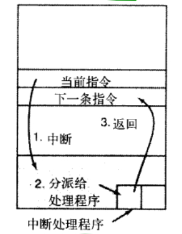
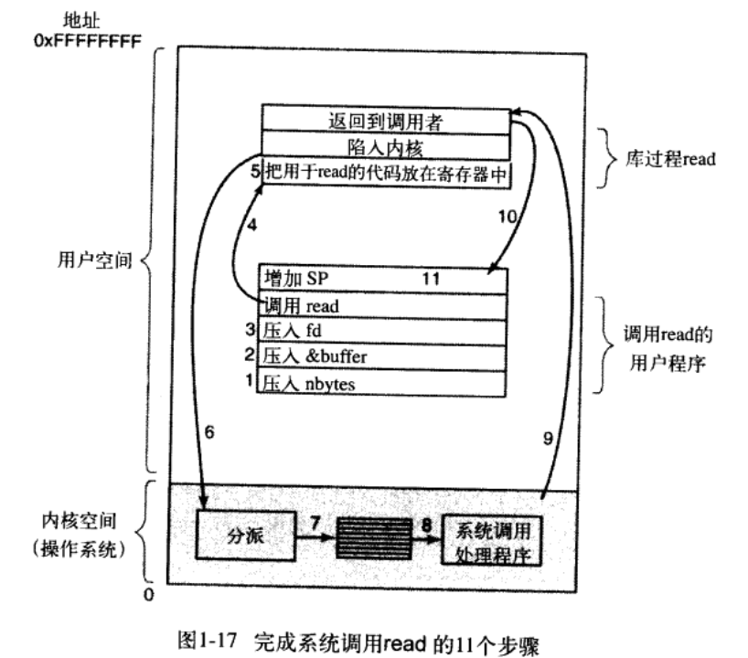
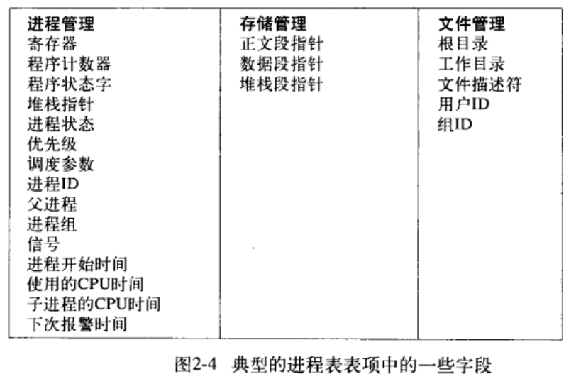

# 现代操作系统

## 引论

计算机安装了一层软件,称为**操作系统**.它的任务是为用户程序提供一个更好,更简单,更清晰的计算机模型,并管理处理器,主存,磁盘等设备.

计算有两种运行模式:*用户态*和*内核态*.内核态下操作系统拥有全部硬件的访问权,可以运行机器能够运行的任何指令;用户态下,只能使用指令的一个子集.

shell或者GUI处于用户态的最低层次.

在内核态运行的一定是操作系统的一部分,但是内核态外运行的程序也有争议的被认为是操作系统的一部分

### 1.1什么是操作系统

操作系统执行两个基本独立的任务:为应用程序员提供一个资源集的清晰抽象,并管理这些硬件资源.

#### 作为扩展机器的操作系统

抽象是管理复杂性的一个关键.第一对抽象进行定义和实现,第二随时使用这些抽象解决问题.操作系统的任务是创建好的抽象,并事项和管理它所创建的抽象对象.**理解抽象是理解操作系统的关键**

操作系统的实际客户是应用程序,它们直接与操作系统及其抽象打交道.

#### 作为资源管理器的操作系统

自顶向下的角度看:操作系统是想应用程序提供基本抽象的概念;自底向上的角度看:操作系统的任务是在互相竞争的程序之间有序的控制对处理器,存储器以及其他I/O接口设备的分配.

资源管理有两种方式:**时间上服用**和**空间上服用**

*时间上复用*:不同程序轮流使用资源

*空间上复用*:每个客户得到资源的一部分

### 1.2操作系统历史 

批处理(没有实时交互)-->分时系统(快速响应)-->MULTIC-->PDP-->UNIX(PDP-7){主要有两个分支Sysytem V和BSD},MINIX(1987)--Linux

intel 8080(1974) IBM+Gates(DOS(Seattle Computer Producer))-->MSDOS(1985~1995)--> Windows 95(1995)-->windows 98(1998)-->windows 2000(1999){NT 4.0-->NT 5.0}-->XP(2001)

intel 80286(1983)

Steve Jobs --> Lisa -->Macintosh(来自于FreeBSD<--BSD)

Unix上都有X11(由MIT开发)Gnome和KDE都在X11之上开发

### 1.3 计算机硬件

现代计算机包含多重总线

#### 处理器

每个CPU周期中,首先从内存取指令,解码以确定类型和操作数,接着执行之,取址->解码->执行->取址...

从内从取数据比执行指令耗时大得多-->CPU内部设置寄存器用来保存临时数据或关键变量-->提供指令将数据从内存存入寄存器,或者将寄存器数据存入内存.

还有对程序员可见的专门寄存器,例如
- *程序计数器*,保存了下一条指令的内存地址
- *堆栈指针*:指向内存中当前栈的顶端.栈中含有已经进入但是还没有退出的每个过程的一个框架.在一个过程的堆栈框架中保存了有关的输入参数,局部变量,以及那些没有保存在寄存器中的临时变量
- *程序状态字(PSW)*:包含条件码位(由比较指令设置),CPU优先级,模式(用户态或者内核态).用户通常读入整PSW,只对其中少量的字段写入.在系统调用和 I/O 中,PSW的作用很重要

在时间服用CPU中操作系统在终止某个程序并启动另一个程序时,必须保存所有的寄存器.

用户态下,想要从操作系统获得服务,用户程序必须使用系统调用.系统调用是的操作系统进入内核态.*TRAP*指令用于把用户态切换到内核态,并启用操作系统.

#### 存储器

寄存器-->高速缓存(L1无时延,L2 1到2个时钟周期)-->内存-->磁盘

高速缓存命中需要两个始终周期,访问内存需要大量的时间.

多核处理器,考虑缓存时共享还是独立,共享需要更复杂的缓存控制器,独立时需要保持缓存一致.

#### 磁盘

扇区-->磁道-->柱面

#### I/O设备

I/O设备一般包含两个部分:设备控制器和设备本身

由于时间的设备接口隐藏在控制器中,所以,操作系统看到的是对控制器的接口.

每类控制器需要不同的软件(**设备驱动程序**)进行控制

设备驱动程序装入到操作系统中,热插拔设备需要动态的装载设备驱动程序

每个设备控制器都有少量的用于通信的寄存器.*所有设备寄存器的集合构成了I/O端口空间*

设备寄存器可以映射为操作系统的地址空间,这样可以像普通存储器一样读出和写入,不需要专门的I/O指令.或者,设备寄存器放入一个专门的I/O端口空间中,每个寄存器都有一个端口地址.在内核态中使用专门的IN和OUT指令,设备驱动程序调用该指令读写这些寄存器.两种方式都广泛被使用

##### 实现输入输出的三种方式

第一种

*忙等待* 设备驱动程序启动I/O并在一个连续不断的循环中检查该设备是否完成工作.当I/O借宿后,设备驱动程序把数据送到指定的地方,并返回,然后操作系统将控制返回给调用者

第二种

*中断* 设备驱动程序启动设备并且让改设备在操作完成时发出一个中断-->设备驱动程序在这个时刻返回-->操作系统接着在需要时阻塞调用者并安排其他工作进行-->当设备驱动程序检测到该设备完成时,他发出一个中断通知操作系统.


1. 设备驱动程序通过写设备寄存器通知设备控制器做什么
2. 使用特定的总线发信号给中断控制器芯片(如果中断控制器已经准备好接受中断,如果忙于一个更高级的中断,可能不接受)
3. 在CPU芯片的一个管脚上声明
4. 中断控制器将设备的编号放到总线上,这样CPU可以读总线,并且知道哪一个设备刚刚完成了操作


一旦CPU决定取中断,通常程序计数器和PSW就被压入当前堆栈中,并且CPU被切换到用户态.设备编号可以成为部分内存的一个引用,用于寻找改设备中断处理程序的地址,这部分内存被称为**中断向量**.
1. 当中断处理程序(中断设备的设备驱动程序的一部分)开始后,它取走已入栈的程序计数器和PSW,并保存之,然后查询设备的状态
2. 当中断处理程序全部完成之后,它返回到先前运行的用户程序中尚未执行的头一条指令

第三种

为I/O使用一种特殊的直接存储器访问(Direct Memory Access,DMA)芯片,它可以控制在内存和某些控制器之间的位流,而无需CPU的干预.CPU对DMA芯片进行设置,说明要传送的字节数,有关的设备和内存地址以及操作方向.当DMA芯片完成时,它引发一个中断(-->进入第二种处理方式)

中断经常会在不合适的时刻发生,互相竞争时高优先级的中断赢得竞争.

#### 总线


#### 启动计算机

基本输入输出系统(BIOS),保存在非可易失RAM中,操作系统可以对其进行更新.

1. BIOS检测RAM数量,键盘和其他基本设备是否安装并正常响应
2. 扫描ISA和PCI总线并找出连接在上面的所有设备,并把设备记录下来
3. 通过尝试存CMOS存储器中的设备清单决定启动设备(用户可以在启动时在BIOS中进行配置)
4. 系统从硬盘启动,**设备上的第一个扇区被读入内存并执行**,这个扇面中包含一个在启动扇面末尾的分区表检查程序,以确定哪一个分区时活动的
5. 从该分区读入第二个启动装载模块.来自活动分区的这个装载模块被读入操作系统,并启动之
6. 操作系统询问BIOS,以获得配置信息
7. 操作系统检查对应的设备驱动程序是否存在.如果存在就调入内核
8. 初始化有关参数,创建需要的任何背景进程,并在每个终端上启动登录程序或GUI

### 1.5操作系统概念

#### 进程

进程本质上时正在执行的一个程序.

*地址空间*从某个最小值到最大值的存储位置列表.在这个范围内,进程可以进行读写.其中包含可执行程序,程序的数据以及程序的堆栈.

还有资源集,打开的文件清单,突出的报警,有关进程清单,以运行该程序所需要的所有其他信息.

进程基本上是容纳云心给一个程序所需要所有信息的容器

进程被挂起时,进程的所有信息都需要保存下来.

**操作系统中存放着一张表,进程表,他是数组结构,当前存在的每一个进程都要占用其中一项**


#### 地址空间

内存中可以只保留一个进程.

内存中存在多个程序时,需要借助于硬件来避免他们互相干扰.这种硬件由操作系统控制

#### 文件

绝对路径与相对路径

读写文件之前需要打开文件-->检查访问权限-->返回一个小整数(文件描述符)供后续操作使用,如果权限不足,则返回一个错误码

*mount系统调用*

UNIX中另一个重要的概念是特殊文件.为了使得I/O设备看起来像文件一般.这样就可以像使用系统调用读写文件一样.由两个特殊文件:*块特殊文件*和*字符特殊文件*.特殊问价在`/dev`下

管道是一种虚拟文件,他可以连接两个进程

### 1.6系统调用

**任何单CPU计算机一次只能执行一条指令**.如果一个进程在用户态中运行一个用户程序,并且需要一个系统服务,比如从一个文件读取数据,那么他就必须必须执行一个陷阱或者系统调用指令,将控制转移到操作系统.然后操作系统通过参数检查,找出所需要的调用进程.然后他执行系统调用,并把控制返回给在系统调用后面跟随着的指令.进行系统调用就像进行一个特殊的过程但是只有系统调用可以进入内核,而过程则不能.

read系统调用



1. 参数压入堆栈
4. 调用库过程
5. 把系统调用的编号放入寄存器中
6. 执行TRAP指令切换到内核态,并在内核中的一个固定地址开始执行
7. 查找系统调用编号(通过一张有系统调用编号所引用的,指向系统调用处理器的指针表来完成)
8. 系统调用句柄运行
9. 句柄完成工作,控制可能会在跟随TRAP指令后面的指令中返回给用户空间过程
10. 返回到用户程序
11. 为了完成整个工作,用户程序还必须清楚堆栈,增加SP

上面*控制可能会在跟随TRAP指令后面的指令中返回给用户空间过程*:系统调用可能阻塞调用者,避免它继续执行.例如试图读键盘,但是并没有任何键入,那么调用者就必须被阻塞.在这种情形下,操作系统会查看是否有其他可以运行的进程.稍后,当需要的输入出现时,进行会提醒系统注意,然后9~11不接着运行.

POSIX大约有100个过程调用

进程管理
- pid=fork() 创建与父进程相同的子进程
- pid=waitpid(pid,@statloc,options) 等待一个子进程终止
- s=execve(name,argv,environp) 替换一个进程的核心映像
- exit(status) 终止进行执行并退出

文件管理
- fd=open(file,how,...) 打开一个文件供读,写或两者.
- s=close(fd) 关闭一个打开的文件
- n=read(fd,buffer,nbytes) 把数据从一个文件读到缓冲区中
- n=write(fd,buffer,nbytes) 把数据从缓冲区写到一个文件中
- position=lseek(fd,offset,whence) 移动文件指针
- s=stat(name,&buf) 取得文件的状态信息

目录和文件系统管理
- s=mkdir(name,mode) 创建一个新目录
- s=rmdir(name) 删除一个空目录
- s=link(name1,name2) 创建一个新目录项2,并指向name1
- s=unlink(name) 上去一个目录项
- s=mount(special,name,flag) 安装一个文件系统
- s=umount(special) 卸载一个文件系统

杂项
- s=chdir(dirname) 改变工作目录
- s=chmod(name,mode) 改变一个文件的保护位
- s=kill(pid,signal) 发送一个信号给一个进程
- seconds=time(&seconds) 自1970年一月一号起的流逝时间

#### 用于进程管理的系统调用

fork是唯一可以在posix创建进程的途径,他创建原有进程的精确副本.fork调用返回一个值,在子进程中该值为零,并且等于子进程的进程标识符,或等于父进程中的PID.使用被返回的PID,就可以分别出父子进程

```c
#include <stdio.h>;
#include <unistd.h>
#include <sys/types.h>
#include <sys/stat.h>
#include <fcntl.h>
void main(int argc, char **argv, char **envp)
{
    for(int i=0;i<argc;i++){
        printf("%s\n",argv[i]);
    }
    int pid = fork();
    if (pid == 0)
    {
        printf("%d", pid);
        printf("parent process");
    }
    else
    {
        printf("child process");
    }

    printf("\n");
}
```
main中argc表示命令行传递的参数个数,argv是参数数组,envp是环境

### 1.7 操作系统结构

单体系统,层次系统,微内核,客户-服务器,虚拟机等

## 第二章 进程与线程

### 2.1 进程

对于单处理器系统,某一瞬间只有一个进程在运行(伪并行)

#### 进程模型

多道程序设计实际是CPU在进程之间来回切换,在任何给定瞬间只有一个进程

#### 创建进程

4种情况下导致进程的创建:
- 系统初始化
- **执行了正在运行的进程所调用的进程创建系统调用**
- 用户请求创建一个新进程
- 一个批处理作业的初始化

停留在后台的进程称为*守护进程*,例如电子邮件,打印

fork之后子进程拥有与父进程相同的存储映像,同样的环境和同样的打开文件.**通常子进程接着执行execve或一个类似的系统调用,以修改其存储映像并运行一个新的程序**.

#### 进程终止

- 正常退出(自愿的)
- 出错退出(自愿的)
- 严重错误(非自愿)
- 被其他进程杀死(非自愿)

exit可以正常退出进程

严重错误:由进程引起的错误,在UNIX中进程可以通知操作系统,他希望自行处理某些类型的错误,在这类错误中,进程会受到信号(被中断),而不是在这类错误时出现终止

#### 进程的层次结构

unix中父子进程形成一棵树,windows中进程同级

#### 进程的状态

运行-->就绪-->阻塞

**当多个程序就绪时,调度程序会决定运行那一个就绪进程,运行多长时间,什么时候运行**

调度程序是操作系统的最底层,在他上面有许多进程.所有关于中断处理,启动进程,停止进程的具体细节都隐藏在调度程序之中.调度程序是一段非常小的程序

#### 进程的实现

操作系统维护一张*进程表(process table)*,数组结构,每一个进程占据一项.每一项包含进程状态的重要信息,包括程序计数器,堆栈指针,内存分配状况,所打开的文件的状态,账号和*调度信息*.



与每一I/O关联的是一个称为*中断向量(interrupt vector)*的位置(靠近内存底部的固定区域).*他包含中断服务程序的入口地址*.

例如磁盘中断时,用户进程3正在运行,则中断硬件将程序计数器,程序状态字,有时还有一个或多个寄存器压入堆栈.计算机随即跳转到中断向量所指示的地址.这些是由硬件完成的所有操作,然后软件,特别是中断服务例程就接管一切剩余的工作.

服务例程结束后,他调用一个C过程处理某个特定的中断类型剩下的工作.在完成有关工作之后,大概就会有某些进程就绪,接着调度程序,决定运行哪个进程.

#### 多道程序设计模型

内存有n个进程时,所有n个进程都在等待I/O操作(此时CPU空转)的概率为P<sup>n</sup>

CPU利用率=1-P<sup>n</sup>

P=I/O时间 / 总时间

增加进程可以提高利用率,但是增加进程占用内存,需要扩大内存,但是随着进程数目的变多,内存扩大CPU利用率的提高会放慢

### 2.2 线程

应用程序中同时发生着多种活动,某些活动随着时间的推移会被阻塞.应用程序分解成可以准并行运行的多个顺序线程.

并行实体共享一个地址空间和所有可用数据的能力.这是多进程模型无法表达的

线程创建比进程创建要快10~100倍

cpu密集型,多线程没有意义.只有存在大量I/O时多线程才有意义

在多CPU系统中,多线程,是的真正的并行具有实现的可能

例子:Web服务器上运行一个*分派线程(dispatcher)*从网络中读入工作请求.检查请求之后,分派线程选择一个空转的(被阻塞的)*工作线程(worker thread)*处理请求.工作线程检查请求是否在高速缓存中...

*多线程*和*单线程*和*单线程*Web服务器

单线程服务器:可以使用read系统调用的非阻塞版本

**服务器在表格中记录当前请求的状态,然后去处理下一个事件.下一个事件可能是新的请求,或者磁盘对先前操作的回答.如果是磁盘的回答,就从表格中找出对应的信息,并处理该回答.对于非阻塞I/O,这种回答多数会议信号或中断的形式出现**

每次服务器从某个请求工作的状态切换到另一个状态时,都必须显示地保存或重新装入相应的计算状态.每一个计算都有一个被保存的状态,存在一个会发生且使得相关装填发生改变的事件集合,这种设计成为*有限状态机*

#### 经典线程模型

进程把资源集中在一起,线程则是在CPU上被调度执行的实体

线程有一个程序计数器,用来记录接着要执行那一条指令.还有保存当前工作变量的寄存器.还有堆栈用来记录执行历史.

线程给进程增加了一向内容:同一个环境中,允许彼此之间有较大独立性的多个线程执行.

线程也叫*轻量级进程*

有些CPU直接硬件支持多线程,并允许线程切换在纳秒级完成


线程状态:阻塞,运行,就绪,终止

线程可以被阻塞,以便等待某个外部事件的发生或等待其他线程来释放他

- *thread_create* 可以创建一个线程
- *thread_exit*退出线程.
- *thread_join*可以等待某个线程的退出,他会阻塞当前线程,直到指定的线程退出为止
- *thread_yield*可以让当前线程主动让出CPU从而让另一个线程执行

#### POSIX线程

- *Pthread_create* 创建一个新线程
- *Pthread_exit* 结束调用的线程
- *Pthread_join* 等待一个特定的线程退出
- *Pthread_yield* 释放CPU来运行另外一个线程
- *Pthread_attr_init* 创建并初始化一个线程的属性结构
- *Pthread_attr_destroy* 删除一个线程的属性结构

*Pthread_attr_init*建立关联一个线程的属性结构并初始化成默认值,这些值(例如优先级)可以通过修改属性结构中的域值来改变

*Pthread_attr_destroy*删除一个线程的属性结构,释放他占用的内存.他不会影响调用他的线程,这些线程会持续存在

#### 在用户空间中实现线程

线程包两种实现方式:*用户空间*和*内核空间*,各有利弊.也有混合实现方式

内核多线程一无所知

第一个也是最明显的优点:可以在不支持线程的操作系统上实现

每个进程需要有专用的*线程表*,记录各个线程的属性

比陷入内核要快一个数量级

允许每个进程有自己定制的调度算法

**缺点**:

使用线程的主要目标:允许每个线程使用阻塞调用,还要避免被阻塞的线程影响其他的线程.有了阻塞系统调用,这个目标不是轻易地能够实现的.

一种可能的方案:如果某个调用会阻塞,就提前通知.UNIX中select可以允许调用者通知语气的read是否会阻塞.首先执行select调用,然后只有在不会阻塞的情况下才会执行read调用.如果会read调用会被阻塞,相关的调用就不进行,而是运行另一个线程

如果一个线程开始,进程中的其他线程就不能运行,除非第一个线程自动放弃CPU.在单独的进程内部,没有时钟中断,所以不可以用轮转调度方式调度.

#### 内核中实现线程

内核线程速度慢

在内核中有用来记录系统中所有线程的线程表

当一个线程阻塞时,内核根据其选择,可以运行统一进程中的另一个线程,或者另一个进程中的线程.(用户级线程,只能运行自己进程中的线程)

在内核中创建和撤销线程的代价大.(有些系统回收线程,当线程撤销时,把他标志为不可运行)

内核线程不需要任何新的,非阻塞系统调用.另外如果某个进程中的线程引起了页面故障,内核可以很方便的检查进程是否有任何其他可运行的线程

> 创建子进程时,子进程是否拥有与父进程一样的线程,还是只有一个线程.很多情况下取决于下一步要做什么.如果子进程继续执行,那么复制所有,如果调用exec启动一个新的程序,那么一个线程可能比较合适


> 信号是发送个进程而不是线程的.当信号到来时,应该由哪一个线程处理它.如果线程可以注册他们感兴趣的信号,那么多个线程注册同一个信号会发生什么

#### 混合实现

用户线程与部分或全部内核线程多路复用

变成人员可以巨鼎多少个内核线程和多少个用户级线程多路复用

每个内核线程有一个可以轮流使用的用户级线程集合

#### 调度程序激活机制

目标是模拟内核线程的功能,但是为线程包提供通常在用户空间才能实现的更好的性能和更大的灵活性.特别的,如果用户线程从事的某种系统调用时安全的,那就不应该进行专门的非阻塞调用或者进行提前检查.无论如何,如果线程阻塞在某个系统调用或者页面故障上,只要一个进程中有任何就绪的线程,就应该可能运行其他的线程

内核给每个进程安排一定数量的*虚拟处理器*,并且让(用户空间)运行时系统将线程分配到处理器上.在多处理器系统中,虚拟处理器有可能成为正式的处理器.分配给进程的虚拟处理器的初始数量只有一个,但是进程可以申请跟多的处理器,并且在不用时退回.内核也可以取回已经分配出去的虚拟处理器,以便把他们分配给其他进程

基本思路:当内核了解到一个线程被阻塞之后,内核通知该进程的运行时系统,并且在堆栈中一参数形式传递有问题的线程编号和所发生事件的一个描述.内核通过在一个一直的启示地址启动运行时系统,从而发出了通知.这是对UNIX信号的一种粗略模拟.这个机制称为*上行调用*

一旦如此激活,运行系统就重新调度器线程.过程通常如下:把当前线程标记为阻塞并从就绪表中取出另一个线程,设置其寄存器,然后再启动之.当内核知道原来的线程有可运行时,内核就有一次上行调用运行时系统,通知他这一事件.此时,运进行时系统按照自己的判断,或者立即重启被阻塞的线程.或者把他放入就绪表中.

如果某个用户线程运行的同事发生一个硬件中断时,被中断的CPU切换进核心态.如果被中断的进程对引起该中断的事件不感兴趣,那么中断处理程序结束之后,就把被中断的线程回复到中断之前的状态.如果感兴趣,那么此时被中断的线程就不在启动,挂起该线程.运行时系统启动对应的虚拟CPU,此时被中断线程保存在堆栈中.随后运行时系统决定在该CPU上调度哪一个线程.

#### 弹出式线程

在分布式系统中经常使用线程.例如处理消息的到来.

传统方式是将进程或线程阻塞在一个receive系统调用了.

另一种,创建一个处理消息的线程,这种线程称为弹出式线程

内核空间运行弹出线程比用户空间容易快捷,并且可以访问所有的表格和I/O设备,处理中断时非常有用.

出错的内核线程比用户线程造成的损害更大

### 2.3 进程间通信IPC(Inter Process Communication)

#### 竞争条件

两个或多个进程读写某些共享数据,而最后的结果取决于进程运行的精确时序,称为*竞争条件*

#### 临界区

找出某种途径来组织多个进程同时读写共享的数据,也就是他们需要*互斥(mutual exclusion)*.

对共享内存进行访问的程序片段称为*临界区(critical section)*

好的解决方案的4个条件:
- 任何两个进程不能同时处于临界区
- 不应对CPU的速度和数量做任何的假设
- 临界区外运行的进程不得阻塞其他进程
- 不得使进程无限期等待进去临界区

#### 忙等待的互斥

##### 屏蔽中断(不可行)

在进程进入临界区时屏蔽所有中断,离开之前在打开中断.屏蔽中断后,时钟中断也被屏蔽.CPU不会切换到其他进程.

只能屏蔽当前CPU中断,不能屏蔽其他CPU中断.并且临界区可能不会退出来

##### 锁变量(不可行)

设想一个共享锁变量,初始值为0.当一个进程想进入临界区时,先测试这把锁,如果值为0,则把值设置为1,并进入临界区.

如果读取到值为0的时候,在他设置为1之前另一个进程被切换过来运行,此时也读取到0,那么他们都认为自己可以进入临界区.

##### 严格轮换法

使用turn来记录轮到哪一个进程进入临界区,初始值为0
```c
//进程0
while 1{
    while(turn!=0)
    critical_region();
    turn=1;
    noncritical_region();
}
```
```c
//进程1
while 1{
    while(turn!=1)
    critical_region();
    turn=0;
    noncritical_region();
}
```
进程1返现turn为0,进入临界区.进程1发现turn不是1,所以进入*忙等待*(连续测试一个变量知道某个值出现为止).只有有理由认为等待时间非常短的情况下,才使用忙等待.用于忙等待的锁称为*自旋锁*.

进程0退出临界区时,在turn值设置为1.此时turn的值1,两个进程都在临界区外执行.

突然进程0结束了非临界区的操作并进入循环的开始.但是这时他不能进入临街区.因为turn的当前值为1,而此时进程1还在忙于非临界区的操作,进程0只有继续while循环,直到进程1把turn值改为0

进程0被非临界区之外的进程阻塞了.

*这个方案要求两个进程严格地轮流进入他们的临界区*

##### Peterson解法

不需要严格轮换的软件互斥算法

```c
#define False 0
#define True 1
#define N 2 //进程数量

int turn; //现在轮到谁?
int interested[N];//所有值初始化为0(False)

void enter_region(int process){
    int other; //其他进程号
    other=1-process;//另一个进程
    interested[process]=True;//表明感兴趣的
    turn=process;//设置标志
    while(turn==process && interested[other]==True);//空语句
}
void leave_region(int process){//进程:谁离开
    interested[process]=Fasle;//表示离开临界区
}
```
开始时没有任何进程进入临界区.现在进程0调用`enter_region`.它通过设置器数组元素和将turn设置为0来标识它希望进入临界区,由于进程1并不想进入临界区.所以`enter_region`很快就返回.

假设两个进程几乎同时调用`enter_region`他们都将自己的进程号存入turn,加入进程1后存入,则turn为1,那么进程0将循环0次并进入临界区.二进程1将不停的循环,直到进程0退出临界区

##### TSL指令

`TSL RX,LOCK`

TSL时*测试并加锁*,它将一个内存自lock读取到寄存RX中.然后在改内存地址上存一个非0值.读和写时不可分割的.该指令结束之前其他处理器不允许访问该内存字.执行TSL的CPU会锁住内存中线,以禁止其他CPU在本指令结束之前访问内存

当lock为0时任何进程都可以使用TSL将其设置为1,并读写共享内存.当操作结束时,进程用一条普通的move指令将lock值设置为0

```
enter_region:
    TSL REGISTER ,LOCK | 复制锁到寄存器并将锁设置为1
    CMP REGISTER,#0    | 锁时0吗?
    JNE enter_region   | 若不是0,说明锁已经被设置,所以循环
    RET                | 返回调用者,进入临界区
leave_region:
    MOVE LOCK,#0       | 将锁存入0
    RET                | 返回调用者
```

##### 睡眠与唤醒

TSL和Peterson的解法都是忙等待.他们浪费CPU

当两个进程具有优先级时,如果高优先级的进程等待低优先级的进程释放锁,但是低优先级的进程始终没有机会释放锁,那么高优先级进程会一直等待.这种情况叫做*优先级反转问题*

考察进程间通信原语.他们在无法进入临界区时将被阻塞,而不是忙等待.最简单的是sleep和wakeup.sleep事宜个将引起进程阻塞的系统调用,即被挂起.直到另一个进程将其唤醒.wakeup调用一个参数,即将要被唤醒的进程.另一个方法是sleep和wakeup都有一个参数

**消费者和生产者问题**也叫有界缓冲区.两个进程共享一个固定大小的缓冲区

生产者写入缓冲区,如果缓冲区满,则挂起.消费者取出消息,如果缓存空,消费者就挂起

设缓冲区有N个数据项,count记录已有数据项.生产者检查count.如果count不满,则写入数据,并且增量count,然后唤醒消费者.消费者检查count如果count=0就挂起,否则取出数据,递减count,然后唤醒生产者

```cpp
#define N 100 //缓冲区槽数目
int count=0; //缓冲区数据数目

void producer(void){
    int item;
    while(True){// 无限循环
        item=produce_item(); // 产生下一个数据项
        if(count==N) sleep(); // 如果缓冲区满了就睡眠
        insert_item(item);   // 将新的数据项放入缓冲区
        count=count+1;       // 缓冲区数据项数目增1
        if(count==1) wakeup(consumer);// 缓冲区空吗
    }    
}

void consumer(void){
    int item;
    while (True){
        if(count==0) sleep;  //如果缓冲区空就睡眠
        item=remove_item();  // 从缓冲区取出一个数据项
        count=count-1;       // 缓冲区数据项数目减1
        if(count=N-1) wakeup(producer);// 缓冲区满吗
        consume_item(item); //打印数据项
    }
}
```
回到竞争条件,这里的count的访问没有加以限制.加入消费者读出count的值为0,于是他决定睡眠,但是在他睡眠之前,生产者进程开始运行,生产者判定count==1,于是他wakeup消费者,但是这里的消费者却还未睡眠.
于是wakeup信号丢失了.

一个快速弥补方法,加上一个唤醒等待位.当一个wakeup信号发送给一个清醒的进程信号时,将改位置1.随后当该进程要睡眠时,如果唤醒等待位为1,那么清楚该位,而该进程任然保持清醒.但是当进程数量庞大时,就要添加无数个唤醒等待位,*没有从根本上解决问题*

##### 信号量

使用一个整型变量来累计唤醒次数,供以后使用. 引入了一个新型变量类型,称作*信号量*.信号量的取值可以是0(表示没有保存下来的唤醒操作)或者正值(表示有一个或多个唤醒操作)

对信号量的down操作:检查其值是否待遇0,大于0,则减1,并继续,若该值为0,则进程睡眠,而且此时down操作并未结束.检查数值,修改变量值以及可能发生的睡眠是一个单一的不可分割的原子操作.保证该操作完后或阻塞之前,其他进程均无法访问该信号量

up操作,对信号量加1,如果一个或多个进程在该信号量上睡眠,无法完成先前的down啊哦做,则有系统选择其中一个并允许该进程完成它的down操作.于是,对于一个有进程在其上睡眠的信号量执行一次up操作之后,该信号量值仍为0,但是其上的睡眠的进程却少了一个.信号量的增1和唤醒一个进程也是不可分割的

**用信号量解决生产者和消费者问题**

通产up和down作为系统调用实现.而且只需在执行以下操作时暂时屏蔽全部中断:测试信号量,更新信号量以及在需要时是某个进程睡眠.如果是多个CPU,则每个信号量应由一个锁变量进行保护.通过TSL或XCHG

使用3个信号量,full表示缓冲区槽数目,一个empty记录空的缓冲槽总数,一个mutex用来确保生产者和消费者不会同时访问缓冲区,mutex初值为1.

供两个或多个进程使用的信号量,其初值为1,保证同时只有一个进程可以进入临界区,称作*二元信号量*.**如果每个进程在进入临界区前都执行一个down操作,并在刚刚推出时执行一个up操作,就能实现互斥**

使用信号量的系统中,隐藏中断最自然的方法是为每一个I/O设备设置一个信号量,其初值为0.当启动一个I/OS设备之后,管理进程就立即对相关量的信号量执行一个down操作,于是进程立即被阻塞.当中断到来时,中断处理程序税后对相关信号量执行一个up操作,从而将相关的进程设为就绪状态

```
#define N 100 //缓冲区槽数目
typedef int semaphore //信号量是一种特殊的整型数据
semahpore mutex=1; //控制临界区的访问
semaphore empty=N; //计数空槽数
semaphore full=0; //计数非空槽数


void producer(void){
    int item;
    while(True){// 无限循环
        item=produce_item(); // 产生下一个数据项
        down(&empty); //空槽数减1
        down(&mutex); //进入临界区
        insert_item(item);   // 将新的数据项放入缓冲区
        up(&mutex);      // 离开缓冲区
        up(&full);   // 非空槽数加1
    }    
}

void consumer(void){
    int item;
    while (True){
        down(&full); //空非槽数减1
        down(&mutex); //进入临界区
        item=remove_item();  // 从缓冲区取出一个数据项
        up(&mutex);      // 离开缓冲区
        up(&full);   // 非空槽数加1
        consume_item(item); //打印数据项
    }
}
```
信号量的另一种用途是实现同步(synchronization)

##### 互斥量

如果不需要信号量的技术能力.可以使用简化版*互斥量(mutex)* 互斥量实现简单,在用户空间线程包非常有用

互斥量是可以处于两态之一的变量:加锁和解锁.只需要一个二进制位.当一个线程需要进入临界区时,他要调用`mutex_lock`,如果调用`mutex_lock`时互斥量已经枷锁,则调用线程被阻塞.直到临界区线程`mutex_unlock`

如果有可用的TSL和XCHG,可以很容易地用户空间实现他们

```
mutex_lock:
    TSL REGISTER,MUTEX |将互斥量复制到寄存器,并且将互斥量置为1
    CMP REGISTER,#0    |互斥量是0吗 
    JZE OK             |如果互斥量为0,他被解锁,所以返回
    CALL thread_yield  |互斥量忙,调度另一个线程
    JMP mutex_lock     |但会调用者,进入临界区
ok:RET

mutex_unlock:
    MOVE MUTEX,#0     |将mutex置为0
    RET               |返回调用者
```

**Pthread中互斥**

Pthread提供许多可以用来同步线程的函数.他使用一个可以被解锁和枷锁的互斥量来保护每个临界区.如果互斥量已经被加锁,则调用线程被阻塞,直到该互斥量被解锁.当他被解锁时,等待的线程中只有一个允许被运行并将互斥量重新锁定

还有一个系统调用可以尝试锁住一个互斥量,当互斥量被已加锁时会返回错误,而不是阻塞调用者`pthread_mutex_trylock`

- `pthread_mutex_init` 创建互斥量
- `pthread_mutex_destroy` 撤销一个已存在的互斥量
- `pthread_mutex_lock` 获得一个锁或者阻塞
- `pthread_mutex_trylock` 获得一个锁或失败
- `pthread_mutex_unlock` 释放一个锁

除了互斥量还有`条件变量`

`pthread_cond_wait`和`pthread_cond_signal`,wait阻塞调用线程直到另一个线程向他发送信号.
- `pthread_cond_init` 创建一个条件变量
- `pthread_cond_destroy` 撤销一个条件变量
- `pthread_cond_wait` 阻塞以等待一个信号
- `pthread_cond_signal` 向一个线程发送信号来唤醒他
- `pthread_cond_broadcast` 向多个线程发送信号来让她们全部唤醒

##### 管程

一种高级的同于原语*管程*

##### 消息传递

send和receive是系统调用而不是语言组成部分

`send(destination,&message)`和`receive(source,&message)`

##### 屏障

所有线程到达同一个地方停下来

### 2.4 调度


