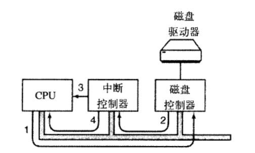
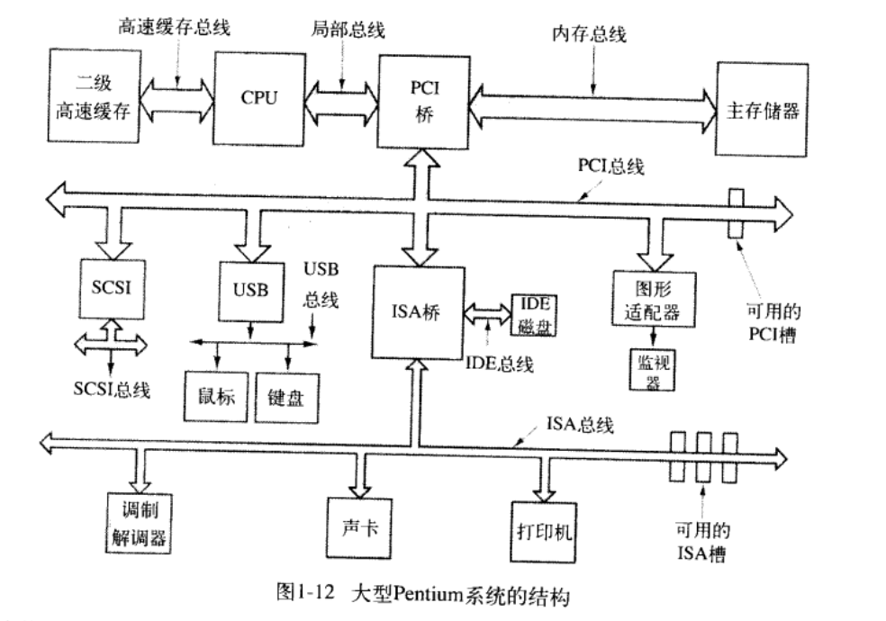

# 现代操作系统

## 引论

计算机安装了一层软件,称为**操作系统**.它的任务是为用户程序提供一个更好,更简单,更清晰的计算机模型,并管理处理器,主存,磁盘等设备.

计算有两种运行模式:*用户态*和*内核态*.内核态下操作系统拥有全部硬件的访问权,可以运行机器能够运行的任何指令;用户态下,只能使用指令的一个子集.

shell或者GUI处于用户态的最低层次.

在内核态运行的一定是操作系统的一部分,但是内核态外运行的程序也有争议的被认为是操作系统的一部分

### 1.1什么是操作系统

操作系统执行两个基本独立的任务:为应用程序员提供一个资源集的清晰抽象,并管理这些硬件资源.

#### 作为扩展机器的操作系统

抽象是管理复杂性的一个关键.第一对抽象进行定义和实现,第二随时使用这些抽象解决问题.操作系统的任务是创建好的抽象,并事项和管理它所创建的抽象对象.**理解抽象是理解操作系统的关键**

操作系统的实际客户是应用程序,它们直接与操作系统及其抽象打交道.

#### 作为资源管理器的操作系统

自顶向下的角度看:操作系统是想应用程序提供基本抽象的概念;自底向上的角度看:操作系统的任务是在互相竞争的程序之间有序的控制对处理器,存储器以及其他I/O接口设备的分配.

资源管理有两种方式:**时间上服用**和**空间上服用**

*时间上复用*:不同程序轮流使用资源

*空间上复用*:每个客户得到资源的一部分

### 1.2操作系统历史 

批处理(没有实时交互)-->分时系统(快速响应)-->MULTIC-->PDP-->UNIX(PDP-7){主要有两个分支Sysytem V和BSD},MINIX(1987)--Linux

intel 8080(1974) IBM+Gates(DOS(Seattle Computer Producer))-->MSDOS(1985~1995)--> Windows 95(1995)-->windows 98(1998)-->windows 2000(1999){NT 4.0-->NT 5.0}-->XP(2001)

intel 80286(1983)

Steve Jobs --> Lisa -->Macintosh(来自于FreeBSD<--BSD)

Unix上都有X11(由MIT开发)Gnome和KDE都在X11之上开发

### 1.3 计算机硬件

现代计算机包含多重总线

#### 处理器

每个CPU周期中,首先从内存取指令,解码以确定类型和操作数,接着执行之,取址->解码->执行->取址...

从内从取数据比执行指令耗时大得多-->CPU内部设置寄存器用来保存临时数据或关键变量-->提供指令将数据从内存存入寄存器,或者将寄存器数据存入内存.

还有对程序员可见的专门寄存器,例如
- *程序计数器*,保存了下一条指令的内存地址
- *堆栈指针*:指向内存中当前栈的顶端.栈中含有已经进入但是还没有退出的每个过程的一个框架.在一个过程的堆栈框架中保存了有关的输入参数,局部变量,以及那些没有保存在寄存器中的临时变量
- *程序状态字(PSW)*:包含条件码位(由比较指令设置),CPU优先级,模式(用户态或者内核态).用户通常读入整PSW,只对其中少量的字段写入.在系统调用和 I/O 中,PSW的作用很重要

在时间服用CPU中操作系统在终止某个程序并启动另一个程序时,必须保存所有的寄存器.

用户态下,想要从操作系统获得服务,用户程序必须使用系统调用.系统调用是的操作系统进入内核态.*TRAP*指令用于把用户态切换到内核态,并启用操作系统.

#### 存储器

寄存器-->高速缓存(L1无时延,L2 1到2个时钟周期)-->内存-->磁盘

高速缓存命中需要两个始终周期,访问内存需要大量的时间.

多核处理器,考虑缓存时共享还是独立,共享需要更复杂的缓存控制器,独立时需要保持缓存一致.

#### 磁盘

扇区-->磁道-->柱面

#### I/O设备

I/O设备一般包含两个部分:设备控制器和设备本身

由于时间的设备接口隐藏在控制器中,所以,操作系统看到的是对控制器的接口.

每类控制器需要不同的软件(**设备驱动程序**)进行控制

设备驱动程序装入到操作系统中,热插拔设备需要动态的装载设备驱动程序

每个设备控制器都有少量的用于通信的寄存器.*所有设备寄存器的集合构成了I/O端口空间*

设备寄存器可以映射为操作系统的地址空间,这样可以像普通存储器一样读出和写入,不需要专门的I/O指令.或者,设备寄存器放入一个专门的I/O端口空间中,每个寄存器都有一个端口地址.在内核态中使用专门的IN和OUT指令,设备驱动程序调用该指令读写这些寄存器.两种方式都广泛被使用

##### 实现输入输出的三种方式

第一种

*忙等待* 设备驱动程序启动I/O并在一个连续不断的循环中检查该设备是否完成工作.当I/O借宿后,设备驱动程序把数据送到指定的地方,并返回,然后操作系统将控制返回给调用者

第二种

*中断* 设备驱动程序启动设备并且让改设备在操作完成时发出一个中断-->设备驱动程序在这个时刻返回-->操作系统接着在需要时阻塞调用者并安排其他工作进行-->当设备驱动程序检测到该设备完成时,他发出一个中断通知操作系统.

1. 设备驱动程序通过写设备寄存器通知设备控制器做什么
2. 使用特定的总线发信号给中断控制器芯片(如果中断控制器已经准备好接受中断,如果忙于一个更高级的中断,可能不接受)
3. 在CPU芯片的一个管脚上声明
4. 中断控制器将设备的编号放到总线上,这样CPU可以读总线,并且知道哪一个设备刚刚完成了操作

一旦CPU决定取中断,通常程序计数器和PSW就被压入当前堆栈中,并且CPU被切换到用户态.设备编号可以成为部分内存的一个引用,用于寻找改设备中断处理程序的地址,这部分内存被称为**中断向量**.
1. 当中断处理程序(中断设备的设备驱动程序的一部分)开始后,它取走已入栈的程序计数器和PSW,并保存之,然后查询设备的状态
2. 当中断处理程序全部完成之后,它返回到先前运行的用户程序中尚未执行的头一条指令

第三种

为I/O使用一种特殊的直接存储器访问(Direct Memory Access,DMA)芯片,它可以控制在内存和某些控制器之间的位流,而无需CPU的干预.CPU对DMA芯片进行设置,说明要传送的字节数,有关的设备和内存地址以及操作方向.当DMA芯片完成时,它引发一个中断(-->进入第二种处理方式)

中断经常会在不合适的时刻发生,互相竞争时高优先级的中断赢得竞争.

#### 总线

#### 启动计算机

基本输入输出系统(BIOS),保存在非可易失RAM中,操作系统可以对其进行更新.

1. BIOS检测RAM数量,键盘和其他基本设备是否安装并正常响应
2. 扫描ISA和PCI总线并找出连接在上面的所有设备,并把设备记录下来
3. 通过尝试存CMOS存储器中的设备清单决定启动设备(用户可以在启动时在BIOS中进行配置)
4. 系统从硬盘启动,**设备上的第一个扇区被读入内存并执行**,这个扇面中包含一个在启动扇面末尾的分区表检查程序,以确定哪一个分区时活动的
5. 从该分区读入第二个启动装载模块.来自活动分区的这个装载模块被读入操作系统,并启动之
6. 操作系统询问BIOS,以获得配置信息
7. 操作系统检查对应的设备驱动程序是否存在.如果存在就调入内核
8. 初始化有关参数,创建需要的任何背景进程,并在每个终端上启动登录程序或GUI

### 1.5操作系统概念

#### 进程

进程本质上时正在执行的一个程序.

*地址空间*从某个最小值到最大值的存储位置列表.在这个范围内,进程可以进行读写.其中包含可执行程序,程序的数据以及程序的堆栈.

还有资源集,打开的文件清单,突出的报警,有关进程清单,以运行该程序所需要的所有其他信息.

进程基本上是容纳云心给一个程序所需要所有信息的容器

进程被挂起时,进程的所有信息都需要保存下来.

**操作系统中存放着一张表,进程表,他是数组结构,当前存在的每一个进程都要占用其中一项**

#### 地址空间

内存中可以只保留一个进程.

内存中存在多个程序时,需要借助于硬件来避免他们互相干扰.这种硬件由操作系统控制

#### 文件

绝对路径与相对路径

读写文件之前需要打开文件-->检查访问权限-->返回一个小整数(文件描述符)供后续操作使用,如果权限不足,则返回一个错误码

*mount系统调用*

UNIX中另一个重要的概念是特殊文件.为了使得I/O设备看起来像文件一般.这样就可以像使用系统调用读写文件一样.由两个特殊文件:*块特殊文件*和*字符特殊文件*.特殊问价在`/dev`下

管道是一种虚拟文件,他可以连接两个进程

### 1.6系统调用

**任何单CPU计算机一次只能执行一条指令**.如果一个进程在用户态中运行一个用户程序,并且需要一个系统服务,比如从一个文件读取数据,那么他就必须必须执行一个陷阱或者系统调用指令,将控制转移到操作系统.然后操作系统通过参数检查,找出所需要的调用进程.然后他执行系统调用,并把控制返回给在系统调用后面跟随着的指令.进行系统调用就像进行一个特殊的过程但是只有系统调用可以进入内核,而过程则不能.

read系统调用

1. 参数压入堆栈
4. 调用库过程
5. 把系统调用的编号放入寄存器中
6. 执行TRAP指令切换到内核态,并在内核中的一个固定地址开始执行
7. 查找系统调用编号(通过一张有系统调用编号所引用的,指向系统调用处理器的指针表来完成)
8. 系统调用句柄运行
9. 句柄完成工作,控制可能会在跟随TRAP指令后面的指令中返回给用户空间过程
10. 返回到用户程序
11. 为了完成整个工作,用户程序还必须清楚堆栈,增加SP

上面*控制可能会在跟随TRAP指令后面的指令中返回给用户空间过程*:系统调用可能阻塞调用者,避免它继续执行.例如试图读键盘,但是并没有任何键入,那么调用者就必须被阻塞.在这种情形下,操作系统会查看是否有其他可以运行的进程.稍后,当需要的输入出现时,进行会提醒系统注意,然后9~11不接着运行.

POSIX大约有100个过程调用

进程管理
- pid=fork() 创建与父进程相同的子进程
- pid=waitpid(pid,@statloc,options) 等待一个子进程终止
- s=execve(name,argv,environp) 替换一个进程的核心映像
- exit(status) 终止进行执行并退出

文件管理
- fd=open(file,how,...) 打开一个文件供读,写或两者.
- s=close(fd) 关闭一个打开的文件
- n=read(fd,buffer,nbytes) 把数据从一个文件读到缓冲区中
- n=write(fd,buffer,nbytes) 把数据从缓冲区写到一个文件中
- position=lseek(fd,offset,whence) 移动文件指针
- s=stat(name,&buf) 取得文件的状态信息

目录和文件系统管理
- s=mkdir(name,mode) 创建一个新目录
- s=rmdir(name) 删除一个空目录
- s=link(name1,name2) 创建一个新目录项2,并指向name1
- s=unlink(name) 上去一个目录项
- s=mount(special,name,flag) 安装一个文件系统
- s=umount(special) 卸载一个文件系统

杂项
- s=chdir(dirname) 改变工作目录
- s=chmod(name,mode) 改变一个文件的保护位
- s=kill(pid,signal) 发送一个信号给一个进程
- seconds=time(&seconds) 自1970年一月一号起的流逝时间
